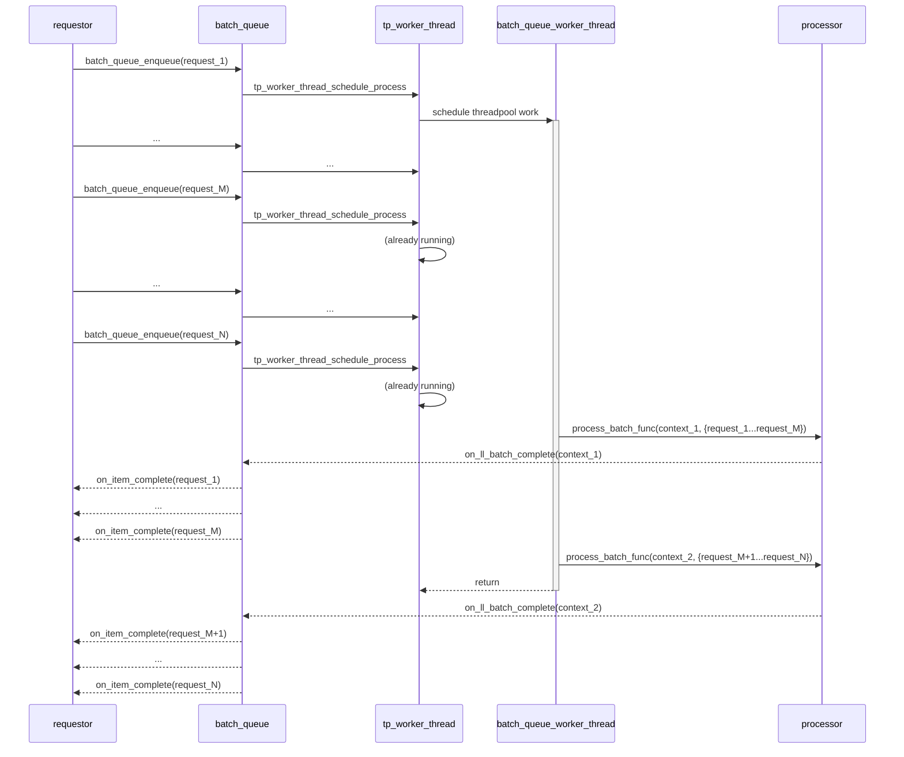

# `batch_queue` Requirements

## Overview

`batch_queue` is a module which provides a way to push data into a queue and pull it off in "batches". It is meant to provide generic batching functionality to any module.

At this time, it provides a basic batching algorithm based on the logic from BSOL in Block Store. The logic covers 90% of the current BSOL code. It could be improved in the future with "smarter" batching to adapt to different workloads.

## Design

- Data is provided to this module in single payloads.
- Each payload is pushed onto a queue internally (MPSC queue).
- When this module receives data, it schedules its single worker thread (if not already running) to process the data.
- The worker thread uses statically configured batch settings to pull items from the queue and provide them to the user callback.
- When a batch is provided to the user callback, this module expects to get another call to indicate its completion for its own bookkeeping and decision making of when to batch.

Settings:

- Max pending requests: The maximum number of requests that can be pending in the queue.
- Max batch size: The maximum size of requests to pull from the queue at once. (Size of a given item provided with the opaque pointer to the data)
- Min batch size: The minimum size of requests to pull from the queue before sending to the user callback.
- Min wait time: The minimum time to wait before sending a batch to the user callback.

### Batching Logic

1. If the number of pending requests is greater than or equal to the max pending requests, then wait for at least one request to complete.
2. Pull all items off the queue one-by-one, checking each size, until the max batch size is reached or there are no more items in the queue.
3. If the total size of the items in the current batch is greater than or equal to the min batch size, then send the batch to the user callback.
4. Otherwise, if the time since the last batch was sent is greater than or equal to the min wait time, then send the batch to the user callback.
5. Otherwise, wait for the min wait time to elapse from the last batch send or for new data to be enqueued.

While this logic does not adapt to changing conditions, it can be tuned for different functionality.

For example, setting a "max pending requests" to 1 would optimize for larger batches at the expense of request throughput. Or, setting a higher "min batch size" and "min wait time" would make the latency typically at least "min wait time" in order to batch more.

### Interaction with other modules

This module is designed to be used with a module which accepts incoming "requests" (requestor) and another module which can process batches of these requests (processor). The requestor and processor may be the same module.



Notes:

- Each call to `batch_queue_enqueue` will schedule the worker thread to process the batch. But the worker thread may start later or already be running. In the example above, the first call starts the thread, which is running when calls 2 through N are made.
- At the time that `batch_queue_worker_thread` executes, it will process all items until it hits a configuration limit (e.g. max batch size). In the diagram above for example, there are N requests enqueued before the `batch_queue_worker_thread` starts and it ends up in 2 batches.

### A Note On Results and "Abandoned"

Note that we follow the pattern here of returning "ABANDONED" for any requests which are not processed.

However, it may be useful for callers of this to differentiate between the lower layers reporting "abandoned" and meaning that the result is indeterminate (the request may or may not have been written to the lower layer) and this queue module reporting "abandoned" and meaning that the request was not processed at all.

Callers can handle this by treating `BATCH_QUEUE_PROCESS_COMPLETE_ABANDONED` as meaning the request was not written at all and handling the `ll_result` opaque type to check if the batch itself returned a specific "abandoned" result and must be treated as indeterminate.

### Faulting and Ordering

This module can support other modules that provide strict ordering guarantees, but does not have strict ordering on completions.

1. All enqueued requests are handled in order and put into batches in the original order.
2. Each batch is processed by the `process_batch_func` sequentially.
3. If any batch fails, then this module will call `on_batch_faulted_func` and stop processing new requests. Assuming the "processor" module and its lower layers also enter a faulted state, then in-flight requests should also fail.
   1. Note that the `on_item_complete` may be called in a different order than the requests were enqueued. Layers above this must handle that.
4. Upon faulting, the requestor module should close the batcher and re-open it in order to fail all the queued requests.
5. The upper layer is responsible for issuing retries after a fault to ensure the retried requests are processed in order.

#### Assumptions

Ordering:
- While  we may assume that for each call to `process_batch_func`, the callback `on_ll_batch_complete` will come in order in the "happy path", there is no such guarantee on failure cases, e.g. during close.
  - For example if 3 calls are made to `process_batch_func` (1, 2, 3) then eventually `on_ll_batch_complete` will be called with the results (1, 2, 3) in that order for a single EBS client (all requests are handled and completed strictly in order on a single thread).
  - But, if the client is closed, between 2 and 3, the third result may come before result 1 or 2 fails. The upper layer must handle this.

## Memory

Note that this module uses the same design as bsol where it allocates a `TARRAY` for staging batches. If this is configured to allow very large batches it is possible for the `TARRAY` to grow to be very large (because it uses a doubling strategy) and it will not be reclaimed until this module is closed (there is no mechanism in `TARRAY` to "shrink"). Future work could be done to optimize this for cases where traffic is bursty and it may be desirable to shrink the array when it is not in use.

For now, this will reduce the allocations needed while building batches.

## Future Work

At this time, the module is incubating in Elastic Log where it is needed, but should be moved somewhere common such as c-util and can likely be re-used in BSOL for Block Store and zrpc. This module could be adapted to have smarter/adaptive batching while keeping its current interface.

## Exposed API

```c
#define BATCH_QUEUE_ENQUEUE_RESULT_VALUES \
    BATCH_QUEUE_ENQUEUE_OK, \
    BATCH_QUEUE_ENQUEUE_INVALID_ARGS, \
    BATCH_QUEUE_ENQUEUE_INVALID_STATE, \
    BATCH_QUEUE_ENQUEUE_ERROR \

MU_DEFINE_ENUM(BATCH_QUEUE_ENQUEUE_RESULT, BATCH_QUEUE_ENQUEUE_RESULT_VALUES)

#define BATCH_QUEUE_PROCESS_COMPLETE_RESULT_VALUES \
    BATCH_QUEUE_PROCESS_COMPLETE_OK, \
    BATCH_QUEUE_PROCESS_COMPLETE_ABANDONED, \
    BATCH_QUEUE_PROCESS_COMPLETE_ERROR \

MU_DEFINE_ENUM(BATCH_QUEUE_PROCESS_COMPLETE_RESULT, BATCH_QUEUE_PROCESS_COMPLETE_RESULT_VALUES)

#define BATCH_QUEUE_PROCESS_SYNC_RESULT_VALUES \
    BATCH_QUEUE_PROCESS_SYNC_OK, \
    BATCH_QUEUE_PROCESS_SYNC_NOT_OPEN, \
    BATCH_QUEUE_PROCESS_SYNC_INVALID_ARGS, \
    BATCH_QUEUE_PROCESS_SYNC_ERROR \

MU_DEFINE_ENUM(BATCH_QUEUE_PROCESS_SYNC_RESULT, BATCH_QUEUE_PROCESS_SYNC_RESULT_VALUES)

typedef void(*BATCH_QUEUE_ON_BATCH_FAULTED)(void* context);

typedef void(*BATCH_QUEUE_ON_ITEM_COMPLETE)(void* context, BATCH_QUEUE_PROCESS_COMPLETE_RESULT result, void* ll_result);

typedef void(*BATCH_QUEUE_ON_LL_BATCH_COMPLETE)(void* batch_context, BATCH_QUEUE_PROCESS_COMPLETE_RESULT result, void* ll_result);

typedef BATCH_QUEUE_PROCESS_SYNC_RESULT(*BATCH_QUEUE_PROCESS_BATCH)(void* process_batch_context, void** items, uint32_t item_count, BATCH_QUEUE_ON_LL_BATCH_COMPLETE on_ll_batch_complete, void* batch_context);

typedef struct BATCH_QUEUE_TAG* BATCH_QUEUE_HANDLE;

typedef struct BATCH_QUEUE_SETTINGS_TAG
{
    uint32_t max_pending_requests;
    uint32_t max_batch_size;
    uint32_t min_batch_size;
    uint32_t min_wait_time;
} BATCH_QUEUE_SETTINGS;

MOCKABLE_FUNCTION(, BATCH_QUEUE_HANDLE, batch_queue_create, BATCH_QUEUE_SETTINGS, settings, EXECUTION_ENGINE_HANDLE, execution_engine, BATCH_QUEUE_PROCESS_BATCH, process_batch_func, void*, process_batch_context, BATCH_QUEUE_ON_BATCH_FAULTED, on_batch_faulted_func, void*, on_batch_faulted_context);
MOCKABLE_FUNCTION(, void, batch_queue_destroy, BATCH_QUEUE_HANDLE, batch_queue);

MOCKABLE_FUNCTION(, int, batch_queue_open, BATCH_QUEUE_HANDLE, batch_queue);
MOCKABLE_FUNCTION(, void, batch_queue_close, BATCH_QUEUE_HANDLE, batch_queue);

MOCKABLE_FUNCTION(, BATCH_QUEUE_ENQUEUE_RESULT, batch_queue_enqueue, BATCH_QUEUE_HANDLE, batch_queue, void*, item, uint32_t, item_size, BATCH_QUEUE_ON_ITEM_COMPLETE, on_item_complete, void*, context);
```

### Static Functions

```c
static void batch_queue_worker_thread(void* context);
static void batch_queue_timer_work(void* context);
static int batch_queue_send_batch(BATCH_QUEUE_HANDLE batch_queue);
static void batch_queue_on_ll_batch_complete(void* context, BATCH_QUEUE_PROCESS_COMPLETE_RESULT result, void* ll_result);
```

### batch_queue_create

```c
MOCKABLE_FUNCTION(, BATCH_QUEUE_HANDLE, batch_queue_create, BATCH_QUEUE_SETTINGS, settings, EXECUTION_ENGINE_HANDLE, execution_engine, BATCH_QUEUE_PROCESS_BATCH, process_batch_func, void*, process_batch_context, BATCH_QUEUE_ON_BATCH_FAULTED, on_batch_faulted_func, void*, on_batch_faulted_context);
```

`batch_queue_create` creates a new batch queue instance with the given batching `settings`.

**SRS_BATCH_QUEUE_42_001: [** If `execution_engine` is `NULL` then `batch_queue_create` shall fail and return `NULL`. **]**

**SRS_BATCH_QUEUE_42_002: [** If `process_batch_func` is `NULL` then `batch_queue_create` shall fail and return `NULL`. **]**

**SRS_BATCH_QUEUE_42_003: [** If `on_batch_faulted_func` is `NULL` then `batch_queue_create` shall fail and return `NULL`. **]**

**SRS_BATCH_QUEUE_42_004: [** If `settings.max_pending_requests` is 0 then `batch_queue_create` shall fail and return `NULL`. **]**

**SRS_BATCH_QUEUE_42_005: [** `batch_queue_create` shall allocate memory for the batch queue. **]**

**SRS_BATCH_QUEUE_42_006: [** `batch_queue_create` shall call `sm_create`. **]**

**SRS_BATCH_QUEUE_42_007: [** `batch_queue_create` shall create a multi producer single consumer queue by calling `mpsc_lock_free_queue_create`. **]**

**SRS_BATCH_QUEUE_42_008: [** `batch_queue_create` shall create a worker thread by calling `tp_worker_thread_create` with `batch_queue_worker_thread`. **]**

**SRS_BATCH_QUEUE_45_013: [** `batch_queue_create` shall keep the execution engine, and call `execution_engine_inc_ref`. **]**

**SRS_BATCH_QUEUE_42_020: [** `batch_queue_create` shall initialize the batch staging array item count and batch size to 0. **]**

**SRS_BATCH_QUEUE_42_009: [** `batch_queue_create` shall return the batch queue handle. **]**

**SRS_BATCH_QUEUE_42_010: [** If there are any other errors then `batch_queue_create` shall fail and return `NULL`. **]**

### batch_queue_destroy

```c
MOCKABLE_FUNCTION(, void, batch_queue_destroy, BATCH_QUEUE_HANDLE, batch_queue);
```

`batch_queue_destroy` destroys the resources from create, implicitly closing the batch queue if it is open.

**SRS_BATCH_QUEUE_42_011: [** If `batch_queue` is `NULL` then `batch_queue_destroy` shall return. **]**

**SRS_BATCH_QUEUE_42_012: [** `batch_queue_destroy` shall behave as if `batch_queue_close` was called. **]**

**SRS_BATCH_QUEUE_42_013: [** `batch_queue_destroy` shall call `tp_worker_thread_destroy`. **]**

**SRS_BATCH_QUEUE_42_014: [** `batch_queue_destroy` shall call `mpsc_lock_free_queue_destroy`. **]**

**SRS_BATCH_QUEUE_45_014: [** `batch_queue_destroy` shall call `execution_engine_dec_ref` on the execution engine. **]**

**SRS_BATCH_QUEUE_42_015: [** `batch_queue_destroy` shall call `sm_destroy`. **]**

**SRS_BATCH_QUEUE_42_016: [** `batch_queue_destroy` shall free the memory allocated for the batch queue. **]**

### batch_queue_open

```c
MOCKABLE_FUNCTION(, int, batch_queue_open, BATCH_QUEUE_HANDLE, batch_queue);
```

`batch_queue_open` opens the batch queue to accept new requests.

**SRS_BATCH_QUEUE_42_017: [** If `batch_queue` is `NULL` then `batch_queue_open` shall fail and return a non-zero value. **]**

**SRS_BATCH_QUEUE_42_018: [** `batch_queue_open` shall call `sm_open_begin`. **]**

**SRS_BATCH_QUEUE_42_019: [** `batch_queue_open` shall call `TARRAY_CREATE` to create a batch staging array. **]**

**SRS_BATCH_QUEUE_42_021: [** If `TARRAY_CREATE` fails then `batch_queue_open` shall call `sm_open_end` with `false`. **]**

**SRS_BATCH_QUEUE_45_015: [** `batch_queue_open` shall call `threadpool_create`. **]**

**SRS_BATCH_QUEUE_42_022: [** `batch_queue_open` shall call `tp_worker_thread_open`. **]**

**SRS_BATCH_QUEUE_42_107: [** `batch_queue_open` shall call `threadpool_timer_start` with `UINT32_MAX` as the `start_delay_ms`, 0 as the `timer_period_ms`, and `batch_queue_timer_work` as the `work_function`. **]**

**SRS_BATCH_QUEUE_42_108: [** `batch_queue_open` shall call `threadpool_timer_cancel`. **]**

**SRS_BATCH_QUEUE_42_023: [** If anything fails after `sm_open_begin` then `batch_queue_open` shall call `sm_open_end` with `false`. **]**

**SRS_BATCH_QUEUE_42_024: [** `batch_queue_open` shall call `sm_open_end` with `true`. **]**

**SRS_BATCH_QUEUE_42_025: [** `batch_queue_open` shall succeed and return 0. **]**

**SRS_BATCH_QUEUE_42_026: [** If there are any errors then `batch_queue_open` shall fail and return a non-zero value. **]**

### batch_queue_close

```c
MOCKABLE_FUNCTION(, void, batch_queue_close, BATCH_QUEUE_HANDLE, batch_queue);
```

`batch_queue_close` closes the batch queue and completes any pending requests with "ABANDONED".

**SRS_BATCH_QUEUE_42_027: [** If `batch_queue` is `NULL` then `batch_queue_close` shall return. **]**

**SRS_BATCH_QUEUE_42_028: [** `batch_queue_close` shall call `sm_close_begin`. **]**

**SRS_BATCH_QUEUE_42_029: [** `batch_queue_close` shall call `threadpool_timer_destroy`. **]**

**SRS_BATCH_QUEUE_42_030: [** `batch_queue_close` shall call `tp_worker_thread_close`. **]**

**SRS_BATCH_QUEUE_45_016: [** `batch_queue_close` shall call `THANDLE_ASSIGN(THREADPOOL)` with `NULL`. **]**

**SRS_BATCH_QUEUE_42_102: [** For each request in the batch staging array: **]**

 - **SRS_BATCH_QUEUE_42_103: [** `batch_queue_close` shall call `on_item_complete` with `BATCH_QUEUE_PROCESS_COMPLETE_ABANDONED` and `NULL` for the `ll_result`. **]**

 - **SRS_BATCH_QUEUE_42_104: [** `batch_queue_close` shall free the memory associated with the request. **]**

**SRS_BATCH_QUEUE_42_031: [** For each request in the queue: **]**

 - **SRS_BATCH_QUEUE_42_032: [** `batch_queue_close` shall call `on_item_complete` with `BATCH_QUEUE_PROCESS_COMPLETE_ABANDONED` and `NULL` for the `ll_result`. **]**

 - **SRS_BATCH_QUEUE_42_033: [** `batch_queue_close` shall free the memory associated with the request. **]**

**SRS_BATCH_QUEUE_42_034: [** `batch_queue_close` shall call `TARRAY_ASSIGN` with `NULL` to free the batch staging array. **]**

**SRS_BATCH_QUEUE_42_035: [** `batch_queue_close` shall call `sm_close_end`. **]**

### batch_queue_enqueue

```c
MOCKABLE_FUNCTION(, BATCH_QUEUE_ENQUEUE_RESULT, batch_queue_enqueue, BATCH_QUEUE_HANDLE, batch_queue, void*, item, uint32_t, item_size, BATCH_QUEUE_ON_ITEM_COMPLETE, on_item_complete, void*, context);
```

`batch_queue_enqueue` enqueues a new item to be processed by the batch queue. It allocates a context for the request and puts it into the queue, then schedules the worker thread in case it is not already running.

**SRS_BATCH_QUEUE_42_036: [** If `batch_queue` is `NULL` then `batch_queue_enqueue` shall fail and return `BATCH_QUEUE_ENQUEUE_INVALID_ARGS`. **]**

**SRS_BATCH_QUEUE_42_037: [** If `item` is `NULL` then `batch_queue_enqueue` shall fail and return `BATCH_QUEUE_ENQUEUE_INVALID_ARGS`. **]**

**SRS_BATCH_QUEUE_42_038: [** If `item_size` is 0 then `batch_queue_enqueue` shall fail and return `BATCH_QUEUE_ENQUEUE_INVALID_ARGS`. **]**

**SRS_BATCH_QUEUE_42_039: [** If `on_item_complete` is `NULL` then `batch_queue_enqueue` shall fail and return `BATCH_QUEUE_ENQUEUE_INVALID_ARGS`. **]**

**SRS_BATCH_QUEUE_42_040: [** `batch_queue_enqueue` shall call `sm_exec_begin`. **]**

**SRS_BATCH_QUEUE_42_041: [** If `sm_exec_begin` fails then `batch_queue_enqueue` shall return `BATCH_QUEUE_ENQUEUE_INVALID_STATE`. **]**

**SRS_BATCH_QUEUE_42_042: [** `batch_queue_enqueue` shall get the current time to store with the request by calling `timer_global_get_elapsed_ms`. **]**

**SRS_BATCH_QUEUE_42_043: [** `batch_queue_enqueue` shall allocate memory for the request context. **]**

**SRS_BATCH_QUEUE_42_044: [** `batch_queue_enqueue` shall call `mpsc_lock_free_queue_enqueue`. **]**

**SRS_BATCH_QUEUE_42_045: [** `batch_queue_enqueue` shall call `tp_worker_thread_schedule_process`. **]**

**SRS_BATCH_QUEUE_42_049: [** `batch_queue_enqueue` shall call `sm_exec_end`. **]**

**SRS_BATCH_QUEUE_42_050: [** `batch_queue_enqueue` shall succeed and return `BATCH_QUEUE_ENQUEUE_OK`. **]**

**SRS_BATCH_QUEUE_42_051: [** If any other error occurs then `batch_queue_enqueue` shall fail and return `BATCH_QUEUE_ENQUEUE_ERROR`. **]**

### batch_queue_worker_thread

```c
static void batch_queue_worker_thread(void* context);
```

`batch_queue_worker_thread` is the worker thread function to process the batch queue and create batches based on the batching settings. It is called by the worker thread and will only ever execute on a single thread at a time.

**SRS_BATCH_QUEUE_42_052: [** If `context` is `NULL` then `batch_queue_worker_thread` shall terminate the process. **]**

**SRS_BATCH_QUEUE_45_010: [** `batch_queue_worker_thread` shall call `sm_exec_begin` to check the timer. **]**

**SRS_BATCH_QUEUE_42_053: [** If a timer has been started then `batch_queue_worker_thread` shall call `threadpool_timer_cancel`. **]**

**SRS_BATCH_QUEUE_45_011: [** `batch_queue_worker_thread` shall call `sm_exec_end` when it is done checking the timer. **]**

**SRS_BATCH_QUEUE_42_054: [** `batch_queue_worker_thread` shall do the following until there are no more items in the queue, or max pending batches have been reached: **]**

 - **SRS_BATCH_QUEUE_42_105: [** `batch_queue_worker_thread` shall call `sm_exec_begin`. **]**

 - **SRS_BATCH_QUEUE_42_109: [** If `sm_exec_begin` fails then `batch_queue_worker_thread` shall exit the loop. **]**

 - **SRS_BATCH_QUEUE_45_012: [** If the pending requests are greater than or equal to `max_pending_requests` then `batch_queue_worker_thread` shall exit the loop. **]**

 - **SRS_BATCH_QUEUE_42_055: [** `batch_queue_worker_thread` shall call `mpsc_lock_free_queue_dequeue`. **]**

 - **SRS_BATCH_QUEUE_42_056: [** If there are items in the batch staging array and the `size` of the dequeued item would cause the staging batch to exceed `max_batch_size` then: **]**

   - **SRS_BATCH_QUEUE_42_057: [** `batch_queue_worker_thread` shall call `batch_queue_send_batch`. **]**

   - **SRS_BATCH_QUEUE_42_058: [** If `batch_queue_send_batch` fails then `batch_queue_worker_thread` shall exit the loop. **]**

 - **SRS_BATCH_QUEUE_42_059: [** `batch_queue_worker_thread` shall call `TARRAY_ENSURE_CAPACITY` on the batch staging array to ensure it can hold the new item. **]**

- **SRS_BATCH_QUEUE_45_001: [** If `TARRAY_ENSURE_CAPACITY` fails then, **]**

   - **SRS_BATCH_QUEUE_45_002: [** `batch_queue_worker_thread` shall call `sm_fault`. **]**

   - **SRS_BATCH_QUEUE_45_003: [** `batch_queue_worker_thread` shall call `on_batch_faulted_func` with `on_batch_faulted_context`. **]**

   - **SRS_BATCH_QUEUE_45_005: [** `batch_queue_worker_thread` shall free the `batch_item_context`. **]**

   - **SRS_BATCH_QUEUE_45_004: [** `batch_queue_worker_thread` shall exit the loop. **]**

 - **SRS_BATCH_QUEUE_42_060: [** `batch_queue_worker_thread` shall add the dequeued item to the batch staging array, increment its count, and add the size of the item to the staging batch size. **]**

**SRS_BATCH_QUEUE_42_061: [** If the batch staging array is not empty and the number of pending batches is less than `max_pending_requests` then: **]**

 - **SRS_BATCH_QUEUE_42_062: [** If the time since the first item in the batch staging array was enqueued is greater than or equal to `min_wait_time` then `batch_queue_worker_thread` shall call `batch_queue_send_batch`. **]**

 - **SRS_BATCH_QUEUE_42_063: [** Otherwise if the size of the batch staging array is greater than or equal to `min_batch_size` then `batch_queue_worker_thread` shall call `batch_queue_send_batch`. **]**

 - **SRS_BATCH_QUEUE_42_064: [** Otherwise `batch_queue_worker_thread` shall call `threadpool_timer_restart` with the difference between `min_wait_time` and the elapsed time of the first operation as the `start_delay_ms` and 0 as the `timer_period_ms`. **]**

 - **SRS_BATCH_QUEUE_42_106: [** `batch_queue_worker_thread` shall call `sm_exec_end`. **]**

### batch_queue_timer_work

```c
static void batch_queue_timer_work(void* context);
```

`batch_queue_timer_work` is a callback meant to be called by the timer thread to wake up the worker thread to process the batch queue based on the time since the oldest item was enqueued.

**SRS_BATCH_QUEUE_42_067: [** If `context` is `NULL` then `batch_queue_timer_work` shall terminate the process. **]**

**SRS_BATCH_QUEUE_42_068: [** `batch_queue_timer_work` shall call `tp_worker_thread_schedule_process`. **]**

### batch_queue_send_batch

```c
static int batch_queue_send_batch(BATCH_QUEUE_HANDLE batch_queue);
```

`batch_queue_send_batch` is an internal helper for `batch_queue_worker_thread`. It takes the staged batch, allocates a context for the batch, and sends it to the processor. In case of error, it puts the module into a faulted state and returns failure.

**SRS_BATCH_QUEUE_42_072: [** `batch_queue_send_batch` shall increment the number of pending batches. **]**

**SRS_BATCH_QUEUE_42_073: [** `batch_queue_send_batch` shall allocate a context for the batch and move the items from the batch staging array to the batch context. **]**

**SRS_BATCH_QUEUE_42_074: [** `batch_queue_send_batch` shall call `sm_exec_begin`. **]**

**SRS_BATCH_QUEUE_42_075: [** `batch_queue_send_batch` shall call `process_batch_func` with the batch context. **]**

**SRS_BATCH_QUEUE_42_076: [** If `process_batch_func` returns anything other than  `BATCH_QUEUE_PROCESS_SYNC_OK` then: **]**

 - **SRS_BATCH_QUEUE_42_077: [** If `process_batch_func` returns `BATCH_QUEUE_PROCESS_SYNC_NOT_OPEN` then `batch_queue_send_batch` shall call `on_item_complete` for each item in the batch with `BATCH_QUEUE_PROCESS_COMPLETE_ABANDONED` and `NULL` for the `ll_result`. **]**

 - **SRS_BATCH_QUEUE_42_079: [** If `process_batch_func` returns anything else then `batch_queue_send_batch` shall call `on_item_complete` for each item in the batch with `BATCH_QUEUE_PROCESS_COMPLETE_ERROR` and `NULL` for the `ll_result`. **]**

 - **SRS_BATCH_QUEUE_45_007: [** `batch_queue_send_batch` shall free each item in the batch. **]**

 - **SRS_BATCH_QUEUE_45_008: [** `batch_queue_send_batch` shall reset the batch staging array size to 0. **]**

 - **SRS_BATCH_QUEUE_45_009: [** `batch_queue_send_batch` shall call `sm_fault`. **]**

 - **SRS_BATCH_QUEUE_42_081: [** `batch_queue_send_batch` shall decrement the number of pending batches. **]**

 - **SRS_BATCH_QUEUE_42_082: [** `batch_queue_send_batch` shall call `sm_exec_end`. **]**

 - **SRS_BATCH_QUEUE_42_083: [** `batch_queue_send_batch` shall call `on_batch_faulted_func` with `on_batch_faulted_context`. **]**

 - **SRS_BATCH_QUEUE_42_084: [** `batch_queue_send_batch` shall return a non-zero value. **]**

**SRS_BATCH_QUEUE_42_085: [** Otherwise (`process_batch_func` returns `BATCH_QUEUE_PROCESS_SYNC_OK`): **]**

 - **SRS_BATCH_QUEUE_42_086: [** `batch_queue_send_batch` shall reset the batch staging array size to 0. **]**

 - **SRS_BATCH_QUEUE_42_087: [** `batch_queue_send_batch` shall succeed and return 0. **]**

**SRS_BATCH_QUEUE_42_110: [** If there are any other errors then `batch_queue_send_batch` shall fail and return a non-zero value. **]**

### batch_queue_on_ll_batch_complete

```c
static void batch_queue_on_ll_batch_complete(void* context, BATCH_QUEUE_PROCESS_COMPLETE_RESULT result, void* ll_result);
```

`batch_queue_on_ll_batch_complete` is a callback meant to be called by the "lower-layer"/"processor" module to report the completion of a batch.

**SRS_BATCH_QUEUE_42_088: [** If `context` is `NULL` then `batch_queue_on_ll_batch_complete` shall terminate the process. **]**

**SRS_BATCH_QUEUE_42_089: [** For each item in the batch: **]**

 - **SRS_BATCH_QUEUE_42_090: [** `batch_queue_on_ll_batch_complete` shall call `on_item_complete` with the `result` and `ll_result` for the item. **]**

 - **SRS_BATCH_QUEUE_42_091: [** `batch_queue_on_ll_batch_complete` shall free the memory allocated during enqueue of the item. **]**

**SRS_BATCH_QUEUE_42_092: [** `batch_queue_on_ll_batch_complete` shall decrement the number of pending batches. **]**

**SRS_BATCH_QUEUE_42_093: [** `batch_queue_on_ll_batch_complete` shall call `sm_exec_end`. **]**

**SRS_BATCH_QUEUE_42_094: [** `batch_queue_on_ll_batch_complete` shall call `tp_worker_thread_schedule_process`. **]**

**SRS_BATCH_QUEUE_45_006: [** `batch_queue_on_ll_batch_complete` shall free the batch context. **]**