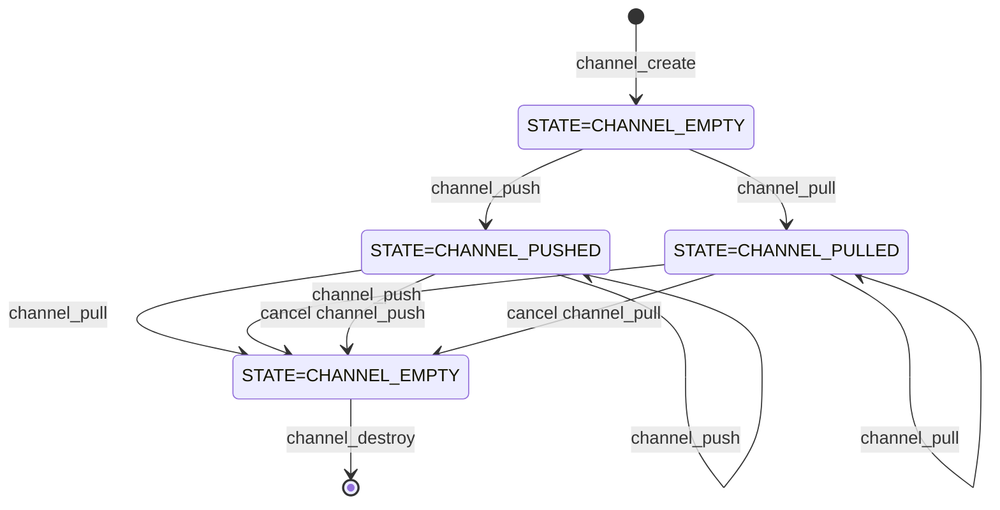
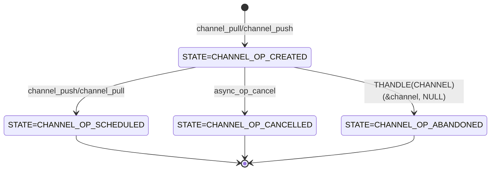

# `channel` requirements

## Overview

`channel` is a module that allows the user to move data asynchronously from producer to consumer without having to block the thread.

Consumers of data call `channel_pull` to register a `PULL_CALLBACK` function to be called when data becomes available.

Producers of data call `channel_push` to notify the channel that data is available and provide a `PUSH_CALLBACK` to be called when the data has been consumed.

`channel_pull` and `channel_push` can be called from different threads in any order. The callbacks are executed on threadpool threads.

## `channel` internal state

The internal state of the `channel` module can have the following values:
  - `CHANNEL_EMPTY`: This is the initial state of the `channel`. It means that there is no data available to be pulled. Calling `channel_pull` or `channel_push` will cause the state to transition to `CHANNEL_PUSHED` or `CHANNEL_PULLED` respectively. After all the `channel_pull` and `channel_push` calls have been paired, the state will transition back to `CHANNEL_EMPTY`.
  - `CHANNEL_PUSHED`: This is the state after `channel_push` has been called. A subsequent call to `channel_pull` will schedule the callbacks on the threadpool.
  - `CHANNEL_PULLED`: This is the state after `channel_pull` has been called. A subsequent call to `channel_push` will the callbacks on the threadpool.



## Operations

The first call to `channel_pull`/`channel_push` either creates an `operation` and adds it to a `list of pending operations`. When `channel_push`/`channel_pull` is called subsequently, the least-recently added `operation` in the `list of pending operations` is scheduled to have its callbacks called on the threadpool. Each operation maintains an internal `state`. The `state` of each `operation` can have the following values:

 - `CHANNEL_OP_CREATED`: This is the initial state of the `operation` after only one of `channel_pull`/`channel_push` have been called. It means that the `operation` has been created and added to the `list of pending operations`. A subsequent call to `channel_push`/`channel_pull` will cause the `operation` to transition to `CHANNEL_OP_SCHEDULED`.

 - `CHANNEL_OP_SCHEDULED`: This is the state after the a pair of `channel_pull`/`channel_push` have been called. It means that the `operation` has been removed from the `list of pending operations` and is scheduled to have its callbacks called on the threadpool with result `CHANNEL_CALLBACK_RESULT_OK`. This is a final state. The `operation` can no longer be cancelled.

 - `CHANNEL_OP_CANCELLED`: This is the state after the `operation` has been cancelled. It means that the `operation` has been removed from the `list of pending operations` and is scheduled to have a callback (either `PULL_CALLBACK` XOR `PUSH_CALLBACK`, depending on which of `channel_pull`/`channel_push` created it) called with result `CHANNEL_CALLBACK_RESULT_CANCELLED`. This is a final state

 - `CHANNEL_OP_ABANDONED`: This is the state after the `operation` has been abandoned. It means that the `operation` has been removed from the `list of pending operations` and is scheduled to have a callback (either `PULL_CALLBACK` XOR `PUSH_CALLBACK`, depending on which of `channel_pull`/`channel_push` created it) called with result `CHANNEL_CALLBACK_RESULT_ABANDONED`. This is a final state.



## Reentrancy

`channel_pull` and `channel_push` can be called from callbacks of this module. Since the callbacks are executed on threadpool threads, there is no risk of stack overflow.

## Internal Reference Counting

`THANDLE(CHANNEL)` maintains a reference to an internal `THANDLE(CHANNEL_INTERNAL)`. `CHANNEL_INTERNAL` is the object that contains the state of the module. This two-level reference counting is needed because the lifetime of the module is linked to the `THANDLE(CHANNEL)` and the `THANDLE(ASYNC_OP)`s returned by `channel_pull` and `channel_push`. 

## Exposed API
```c
#define CHANNEL_RESULT_VALUES \
    CHANNEL_RESULT_OK, \
    CHANNEL_RESULT_INVALID_ARGS, \
    CHANNEL_RESULT_ERROR

MU_DEFINE_ENUM(CHANNEL_RESULT, CHANNEL_RESULT_VALUES);

#define CHANNEL_CALLBACK_RESULT_VALUES \
    CHANNEL_CALLBACK_RESULT_OK, \
    CHANNEL_CALLBACK_RESULT_CANCELLED, \
    CHANNEL_CALLBACK_RESULT_ABANDONED

MU_DEFINE_ENUM(CHANNEL_CALLBACK_RESULT, CHANNEL_CALLBACK_RESULT_VALUES);

typedef void(*PULL_CALLBACK)(void* pull_context, CHANNEL_CALLBACK_RESULT result, THANDLE(RC_PTR) data);
typedef void(*PUSH_CALLBACK)(void* push_context, CHANNEL_CALLBACK_RESULT result);
typedef struct CHANNEL_TAG CHANNEL;

#include "umock_c/umock_c_prod.h"
#ifdef __cplusplus
extern "C" {
#endif /* __cplusplus */

THANDLE_TYPE_DECLARE(CHANNEL);

    MOCKABLE_FUNCTION(, THANDLE(CHANNEL), channel_create, THANDLE(THREADPOOL), threadpool);
    MOCKABLE_FUNCTION(, CHANNEL_RESULT, channel_pull, THANDLE(CHANNEL), channel, PULL_CALLBACK, pull_callback, void*, pull_context, THANDLE(ASYNC_OP)*, out_op_pull);
    MOCKABLE_FUNCTION(, CHANNEL_RESULT, channel_push, THANDLE(CHANNEL), channel, THANDLE(RC_PTR), data, PUSH_CALLBACK, push_callback, void*, push_context, THANDLE(ASYNC_OP)*, out_op_push);

#ifdef __cplusplus
}
#endif /* __cplusplus */

```

### channel_create
```c
    MOCKABLE_FUNCTION(, THANDLE(CHANNEL), channel_create, THANDLE(THREADPOOL), threadpool);
```

`channel_create` creates the channel and returns it.

**SRS_CHANNEL_43_077: [** If `threadpool` is `NULL`, `channel_create` shall fail and return `NULL`. **]**

**SRS_CHANNEL_43_001: [** `channel_create` shall create a `CHANNEL` object by calling `THANDLE_MALLOC` with `channel_dispose` as `dispose`. **]**

**SRS_CHANNEL_43_078: [** `channel_create` shall create a `CHANNEL_INTERNAL` object by calling `THANDLE_MALLOC` with `channel_internal_dispose` as `dispose`.**]**

**SRS_CHANNEL_43_079: [** `channel_create` shall store the created `THANDLE(CHANNEL_INTERNAL)` in the `THANDLE(CHANNEL)`. **]**

**SRS_CHANNEL_43_080: [** `channel_create` shall initialize the `CHANNEL_INTERNAL` with the given `threadpool`. **]**

**SRS_CHANNEL_43_098: [** `channel_create` shall call `srw_lock_create`. **]**

**SRS_CHANNEL_43_084: [** `channel_create` shall call `DList_InitializeListHead`. **]**

**SRS_CHANNEL_43_085: [** `channel_create` shall set the `state` to `CHANNEL_EMPTY`. **]**

**SRS_CHANNEL_43_086: [** `channel_create` shall succeed and return the created `THANDLE(CHANNEL)`. **]**

**SRS_CHANNEL_43_002: [** If there are any failures, `channel_create` shall fail and return `NULL`. **]**


### channel_dispose
```c
    static void channel_dispose(CHANNEL* channel);
```

`channel_dispose` disposes the given `channel` and schedules all pending operations to be abandoned.

**SRS_CHANNEL_43_094: [** `channel_dispose` shall call `srw_lock_acquire_exclusive`. **]**

**SRS_CHANNEL_43_095: [** `channel_dispose` shall iterate over the list of pending operations and do the following: **]**

 - **SRS_CHANNEL_43_096: [** set the `operation state` to `CHANNEL_OP_ABANDONED`. **]**
 
 - **SRS_CHANNEL_43_097: [** call `threadpool_schedule_work` with `execute_callbacks` as `work_function`. **]**

**SRS_CHANNEL_43_100: [** `channel_dispose` shall call `srw_lock_release_exclusive`. **]**

**SRS_CHANNEL_43_092: [** `channel_dispose` shall release the reference to `THANDLE(CHANNEL_INTERNAL)`. **]**


### channel_dispose_internal
```c
    static void channel_dispose_internal(CHANNEL_INTERNAL* channel_internal);
```

`channel_dispose_internal` disposes the given `channel_internal`.

**SRS_CHANNEL_43_099: [** `channel_dispose_internal` shall call `srw_lock_destroy`. **]**

**SRS_CHANNEL_43_091: [** `channel_dispose_internal` shall release the reference to `THANDLE(THREADPOOL)`. **]**

### channel_pull
```c
    MOCKABLE_FUNCTION(, CHANNEL_RESULT, channel_pull, THANDLE(CHANNEL), channel, PULL_CALLBACK, pull_callback, void*, pull_context, THANDLE(ASYNC_OP)*, out_op_pull);
```

`channel_pull` registers the given `pull_callback` to be called when there is data to be consumed.

**SRS_CHANNEL_43_007: [** If `channel` is `NULL`, `channel_pull` shall fail and return `CHANNEL_RESULT_INVALID_ARGS`. **]**

**SRS_CHANNEL_43_008: [** If `pull_callback` is `NULL`, `channel_pull` shall fail and return `CHANNEL_RESULT_INVALID_ARGS`. **]**

**SRS_CHANNEL_43_009: [** If `out_op_pull` is `NULL`, `channel_pull` shall fail and return `CHANNEL_RESULT_INVALID_ARGS`. **]**

**SRS_CHANNEL_43_010: [** `channel_pull` shall call `srw_lock_acquire_exclusive`. **]**

**SRS_CHANNEL_43_101: [** If the `state` of the `channel` is `CHANNEL_EMPTY` or `CHANNEL_PULLED`: **]**

 - **SRS_CHANNEL_43_103: [** `channel_pull` shall create a `THANDLE(ASYNC_OP)` by calling `async_op_create` with `cancel_channel_op` as `cancel`. **]**

 - **SRS_CHANNEL_43_104: [** `channel_pull` shall store the `pull_callback` and `pull_context` in the `THANDLE(ASYNC_OP)`. **]**

 - **SRS_CHANNEL_43_105: [** `channel_pull` shall insert the created `THANDLE(ASYNC_OP)` in the list of pending operations by calling `DList_InsertTailList`. **]**

 - **SRS_CHANNEL_43_106: [** set the `state` to `CHANNEL_PULLED`. **]**

 - **SRS_CHANNEL_43_107: [** set `*out_op_pull` to the created `THANDLE(ASYNC_OP)`. **]**

**SRS_CHANNEL_43_108: [** If the `state` of the `channel` is `CHANNEL_PUSHED`: **]**

 - **SRS_CHANNEL_43_109: [** `channel_pull` shall call `DList_RemoveHeadList` on the list of pending operations to obtain the `operation`. **]**

 - **SRS_CHANNEL_43_110: [** If the list of pending operations is now empty, `channel_pull` shall set the `state` to `CHANNEL_EMPTY`. **]**

 - **SRS_CHANNEL_43_111: [** `channel_pull` shall set the `state` of the obtained `operation` to `CHANNEL_OP_SCHEDULED`. **]**

 - **SRS_CHANNEL_43_112: [** `channel_pull` shall store the `pull_callback` and `pull_context` in the obtained `operation`. **]**

 - **SRS_CHANNEL_43_113: [** `channel_pull` shall call `threadpool_schedule_work` with `execute_callbacks` as `work_function` and the obtained `operation` as `work_function_context`. **]**

 - **SRS_CHANNEL_43_114: [** `channel_pull` shall set `*out_op_pull` to the `THANDLE(ASYNC_OP)` of the obtained `operation`. **]**

**SRS_CHANNEL_43_115: [** `channel_pull` shall call `srw_lock_release_exclusive`. **]**

**SRS_CHANNEL_43_011: [** `channel_pull` shall succeeds and return `CHANNEL_RESULT_OK`. **]**

**SRS_CHANNEL_43_023: [** If there are any failures, `channel_pull` shall fail and return `CHANNEL_RESULT_ERROR`. **]**


### channel_push
```c
    MOCKABLE_FUNCTION(, CHANNEL_RESULT, channel_push, THANDLE(CHANNEL), channel, THANDLE(RC_PTR), data, PUSH_CALLBACK, push_callback, void*, push_context, THANDLE(ASYNC_OP)*, out_op_push);
```

`channel_push` notifies the channel that there is data available and registers the given `push_callback` to be called when the given `data` has been consumed.

**SRS_CHANNEL_43_024: [** If `channel` is `NULL`, `channel_push` shall fail and return `CHANNEL_RESULT_INVALID_ARGS`. **]**

**SRS_CHANNEL_43_025: [** If `push_callback` is `NULL`, `channel_push` shall fail and return `CHANNEL_RESULT_INVALID_ARGS`. **]**

**SRS_CHANNEL_43_026: [** If `out_op_push` is `NULL`, `channel_push` shall fail and return `CHANNEL_RESULT_INVALID_ARGS`. **]**

**SRS_CHANNEL_43_116: [** `channel_push` shall call `srw_lock_acquire_exclusive`. **]**

**SRS_CHANNEL_43_117: [** If the `state` of the `channel` is `CHANNEL_EMPTY` or `CHANNEL_PUSHED`: **]**

 - **SRS_CHANNEL_43_119: [** `channel_push` shall create a `THANDLE(ASYNC_OP)` by calling `async_op_create` with `cancel_channel_op` as `cancel`. **]**

 - **SRS_CHANNEL_43_120: [** `channel_push` shall store the `push_callback`, `push_context` and `data` in the `THANDLE(ASYNC_OP)`. **]**

 - **SRS_CHANNEL_43_121: [** `channel_push` shall insert the created `THANDLE(ASYNC_OP)` in the list of pending operations by calling `DList_InsertTailList`. **]**

 - **SRS_CHANNEL_43_122: [** set the `state` to `CHANNEL_PUSHED`. **]**

 - **SRS_CHANNEL_43_123: [** set `*out_op_push` to the created `THANDLE(ASYNC_OP)`. **]**

**SRS_CHANNEL_43_124: [** If the `state` of the `channel` is `CHANNEL_PULLED`: **]**

 - **SRS_CHANNEL_43_125: [** `channel_push` shall call `DList_RemoveHeadList` on the list of pending operations to obtain the `operation`. **]**

 - **SRS_CHANNEL_43_126: [** If the list of pending operations is now empty, `channel_push` shall set the `state` to `CHANNEL_EMPTY`. **]**

 - **SRS_CHANNEL_43_127: [** `channel_push` shall set the `state` of the obtained `operation` to `CHANNEL_OP_SCHEDULED`. **]**

 - **SRS_CHANNEL_43_128: [** `channel_push` shall store the `push_callback`, `push_context` and `data` in the obtained `operation`. **]**

 - **SRS_CHANNEL_43_129: [** `channel_push` shall call `threadpool_schedule_work` with `execute_callbacks` as `work_function` and the obtained `operation` as `work_function_context`. **]**

 - **SRS_CHANNEL_43_130: [** `channel_push` shall set `*out_op_push` to the `THANDLE(ASYNC_OP)` of the obtained `operation`. **]**

**SRS_CHANNEL_43_131: [** `channel_push` shall call `srw_lock_release_exclusive`. **]**

**SRS_CHANNEL_43_132: [** `channel_push` shall succeed and return `CHANNEL_RESULT_OK`. **]**

**SRS_CHANNEL_43_041: [** If there are any failures, `channel_push` shall fail and return `CHANNEL_RESULT_ERROR`. **]**


### cancel_channel_op
```c
    static void cancel_channel_op(void* channel_op_context);
```

`cancel_channel_op` is the cancel callback that is passed to `async_op_create` when creating a `THANDLE(ASYNC_OP)` for a `channel_push` or `channel_pull` operation.

**SRS_CHANNEL_43_134: [** `cancel_channel_op` shall call `srw_lock_acquire_exclusive`. **]**

**SRS_CHANNEL_43_135: [** If the `state` of `operation` is `CHANNEL_OP_CREATED`: **]**

 - **SRS_CHANNEL_43_136: [** `cancel_channel_op` shall set the `state` to `CHANNEL_OP_CANCELLED` **]**

 - **SRS_CHANNEL_43_137: [** `cancel_channel_op` shall call `DList_RemoveEntryList` to remove the `operation` from the list of pending operations. **]**

 - **SRS_CHANNEL_43_138: [** `cancel_channel_op` shall call `threadpool_schedule_work` with `execute_callbacks` as `work_function` and the `operation` as `work_function_context`. **]**

**SRS_CHANNEL_43_139: [** `cancel_channel_op` shall call `srw_lock_release_exclusive`. **]**


### execute_callbacks
```c
    static void execute_callbacks(void* channel_op_context);
```

`execute_callbacks` is the work function that is passed to `threadpool_schedule_work` when scheduling the execution of the callbacks for an operation.

**SRS_CHANNEL_43_140: [** If the `state` of the `operation` is `CHANNEL_OP_SCHEDULED`, `execute_callbacks` shall call the `pull_callback` and the `push_callback` with `CHANNEL_CALLBACK_RESULT_OK`. **]**

**SRS_CHANNEL_43_141: [** If the `state` of the `operation` is `CHANNEL_OP_CANCELLED`, `execute_callbacks` shall call the registered callback with `CHANNEL_CALLBACK_RESULT_CANCELLED`. **]**

**SRS_CHANNEL_43_142: [** If the `state` of the `operation` is `CHANNEL_OP_ABANDONED`, `execute_callbacks` shall call the registered callback with `CHANNEL_CALLBACK_RESULT_ABANDONED`. **]**
