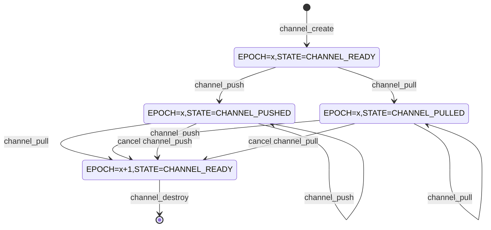

# `channel` requirements

## Overview

`channel` is a module that allows the user to move data asynchronously from producer to consumer without having to block the thread.

Consumers of data call `channel_pull` to register a `PULL_CALLBACK` function to be called when data becomes available.

Producers of data call `channel_push` to notify the channel that data is available.

`channel_pull` and `channel_push` can be called from different threads in any order.

## `channel` state

The state of the `channel` module consists of two components:
- EPOCH: This is a monotonically increasing integer that is incremented every time an operation is completed or cancelled.
- Internal state: This is an enum that can have the following values:
  - `CHANNEL_READY`: This is the default state. In this state, the module accepts calls to `channel_pull` and `channel_push`
  - `CHANNEL_PUSHING`: This is a temporary state when `channel_push` is executing. It causes concurrent calls to `channel_pull` to wait.
  - `CHANNEL_PUSHED`: This is the state when `channel_push` has completed execution. A subsequent call to `channel_pull` will result in the callbacks being called synchronously.
  - `CHANNEL_PULLING`: This is a temporary state when `channel_pull` is executing. It causes concurrent calls to `channel_push` to wait.
  - `CHANNEL_PULLED`: This is the state when `channel_pull` has completed execution. A subsequent call to `channel_push` will result in the callback being called synchronously.

Both components are stored in a single `volatile_atomic` variable that is manipulated using `interlocked` APIs.



## Reentrancy

`channel` is reentrant. This means that `channel_pull` and `channel_push` can be called from callbacks of this module.

## Exposed API
```c
#define CHANNEL_RESULT_VALUES \
    CHANNEL_RESULT_SYNC, \
    CHANNEL_RESULT_ASYNC, \
    CHANNEL_RESULT_REFUSED, \
    CHANNEL_RESULT_INVALID_ARGS, \
    CHANNEL_RESULT_ERROR

MU_DEFINE_ENUM(CHANNEL_RESULT, CHANNEL_RESULT_VALUES);

#define CHANNEL_CALLBACK_RESULT_VALUES \
    CHANNEL_CALLBACK_RESULT_OK, \
    CHANNEL_CALLBACK_RESULT_CANCELLED, \
    CHANNEL_CALLBACK_RESULT_ABANDONED

MU_DEFINE_ENUM(CHANNEL_CALLBACK_RESULT, CHANNEL_CALLBACK_RESULT_VALUES);

#include "umock_c/umock_c_prod.h"
#ifdef __cplusplus
extern "C" {
#endif /* __cplusplus */

typedef void(*PULL_CALLBACK)(void* pull_context, THANDLE(RC_PTR) data, CHANNEL_CALLBACK_RESULT result);
typedef void(*PUSH_CALLBACK)(void* push_context, CHANNEL_CALLBACK_RESULT result);
typedef struct CHANNEL_TAG CHANNEL;

THANDLE_TYPE_DECLARE(CHANNEL);

    MOCKABLE_FUNCTION(, THANDLE(CHANNEL), channel_create)
    MOCKABLE_FUNCTION(, CHANNEL_RESULT, channel_pull, THANDLE(CHANNEL), channel, PULL_CALLBACK, pull_callback, void*, pull_context, THANDLE(ASYNC_OP)*, out_op_pull);
    MOCKABLE_FUNCTION(, CHANNEL_RESULT, channel_push, THANDLE(CHANNEL), channel, THANDLE(RC_PTR), data, PUSH_CALLBACK, push_callback, void*, push_context, THANDLE(ASYNC_OP)*, out_op_push);

#ifdef __cplusplus
}
#endif /* __cplusplus */

```

### channel_create
```c
    MOCKABLE_FUNCTION(, CHANNEL_HANDLE, channel_create)
```

`channel_create` creates the channel and returns it.

**SRS_CHANNEL_43_001: [** `channel_create` shall call `THANDLE_MALLOC` with `dispose` as `channel_dispose`. **]**

**SRS_CHANNEL_43_056: [** `channel_create` shall set the `state` to `CHANNEL_READY` and `EPOCH` to `0` by calling `interlocked_exchange`. **]**

**SRS_CHANNEL_43_002: [** If there are any failures, `channel_create` shall fail and return `NULL`. **]**

### channel_dispose
```c
    void channel_dispose(CHANNEL* channel)
```

`channel_dispose` disposes the given `channel`.

**SRS_CHANNEL_43_004: [** `channel_dispose` shall obtain the current state of the channel by calling `interlocked_add`. **]**

**SRS_CHANNEL_43_057: [** If the current `state` is `CHANNEL_PULLING` or `CHANNEL_PUSHING`, `channel_dispose` shall wait for the state to change by calling `wait_on_address`. **]**

**SRS_CHANNEL_43_058: [** If the current `state` is `CHANNEL_PULLED`, `channel_dispose` shall call the `pull_callback` given to `channel_pull` with `pull_context` as the `pull_context` given to `channel_pull`, and `result` as `CHANNEL_CALLBACK_RESULT_ABANDONED`. **]**

**SRS_CHANNEL_43_006: [** If the current `state` is `CHANNEL_PUSHED`, `channel_dispose` shall: **]**

- **SRS_CHANNEL_43_044: [** call the `push_callback` given to `channel_push` with `push_context` as the `push_context` given to `channel_push`, and `result` as `CHANNEL_RESULT_ABANDONED`. **]**

- **SRS_CHANNEL_43_045: [** release the reference to `data` stored in `channel` by calling `THANDLE_ASSIGN`. **]**

### channel_pull
```c
    MOCKABLE_FUNCTION(, CHANNEL_RESULT, channel_pull, THANDLE(CHANNEL), channel, PULL_CALLBACK, pull_callback, void*, pull_context, THANDLE(ASYNC_OP)*, out_op_pull);
```

`channel_pull` registers the given `pull_callback` to be called when there is data to be consumed.

**SRS_CHANNEL_43_007: [** If `channel` is `NULL`, `channel_pull` shall fail and return `CHANNEL_RESULT_INVALID_ARGS`. **]**

**SRS_CHANNEL_43_008: [** If `pull_callback` is `NULL`, `channel_pull` shall fail and return `CHANNEL_RESULT_INVALID_ARGS`. **]**

**SRS_CHANNEL_43_009: [** If `out_op_pull` is `NULL`, `channel_pull` shall fail and return `CHANNEL_RESULT_INVALID_ARGS`. **]**

**SRS_CHANNEL_43_010: [** `channel_pull` shall call `interlocked_add` to obtain the current `state` of the `channel`. **]**

**SRS_CHANNEL_43_011: [** If the current `state` is `CHANNEL_PULLING` or `CHANNEL_PULLED`, `channel_pull` shall fail and return `CHANNEL_RESULT_REFUSED`. **]**

**SRS_CHANNEL_43_059: [** If the current `state` is `CHANNEL_PUSHING`, `channel_pull` shall wait for the `state` to change by calling `wait_on_address`. **]**

**SRS_CHANNEL_43_012: [** If the current `state` is `CHANNEL_PUSHED`, `channel_pull` shall : **]**

- **SRS_CHANNEL_43_060: [** store `push_callback`, `push_context` and `data` given to `channel_push`. **]**

- **SRS_CHANNEL_43_042: [** call `interlocked_compare_exchange` to increment the `EPOCH` and change the state to `CHANNEL_READY`. **]**

- **SRS_CHANNEL_43_013: [** call the given `pull_callback` with `pull_context` as the given `pull_context`, `data` as the stored `data` and `result` as `CHANNEL_RESULT_OK`. **]**

- **SRS_CHANNEL_43_053: [** release the reference to the stored `data` by calling `THANDLE_ASSIGN`. **]**

- **SRS_CHANNEL_43_014: [** call the stored `push_callback` with the stored `push_context` and `result` as `CHANNEL_RESULT_OK`. **]**

- **SRS_CHANNEL_43_054: [** set `out_op_pull` to `NULL` by calling `THANDLE_ASSIGN`. **]**

- **SRS_CHANNEL_43_015: [** return `CHANNEL_RESULT_SYNC`. **]**

**SRS_CHANNEL_43_016: [** If the current state is `CHANNEL_READY`, `channel_pull` shall: **]**

**SRS_CHANNEL_43_061: [** set the state to `CHANNEL_PULLING` by calling `interlocked_compare_exchange`. **]**

- **SRS_CHANNEL_43_017: [** call `async_op_create` with `cancel_pull` as the cancel function. **]**

- **SRS_CHANNEL_43_018: [** store the given `pull_callback` and the given `pull_context` in the `channel`. **]**

- **SRS_CHANNEL_43_019: [** store `state` in the created `THANDLE(ASYNC_OP)`. **]**

- **SRS_CHANNEL_43_020: [** store the given `channel` in the created `THANDLE(ASYNC_OP)` by calling `THANDLE_INITIALIZE`. **]**

- **SRS_CHANNEL_43_021: [** store the created `THANDLE(ASYNC_OP)` in `out_op_pull` by calling `THANDLE_INITIALIZE_MOVE`. **]**

- **SRS_CHANNEL_43_062: [** set the `state` of the given `channel` to `CHANNEL_PULLED` by calling `interlocked_exchange`. **]**

- **SRS_CHANNEL_43_063: [** signal waiting threads by calling `wake_by_address_all`. **]**

- **SRS_CHANNEL_43_022: [** return `CHANNEL_RESULT_ASYNC`. **]**

**SRS_CHANNEL_43_023: [** If there are any failures, `channel_pull` shall fail and return `CHANNEL_RESULT_ERROR`. **]**

### cancel_pull
```
static void cancel_pull(void* context)
```

`cancel_pull` is the cancel function given to `async_op_create` when `channel_pull` is called.

**SRS_CHANNEL_43_046: [** If the current `EPOCH` and `state` of the `channel` is the same as the initial `EPOCH` and `state` of the `channel` when `channel_pull` was called, `cancel_pull` shall: **]**

- **SRS_CHANNEL_43_047: [** increment the `EPOCH` and set the `state` of the `channel` stored in the given `context` to `CHANNEL_READY` by calling `interlocked_compare_exchange`. **]**

- **SRS_CHANNEL_43_048: [** call the `pull_callback` given to `channel_pull` with `pull_context` as the `pull_context` given to `channel_pull`, `data` as `NULL` and `result` as `CHANNEL_RESULT_CANCELLED`. **]**


### channel_push
```c
    MOCKABLE_FUNCTION(, CHANNEL_RESULT, channel_push, THANDLE(CHANNEL), channel, THANDLE(RC_PTR), data, PUSH_CALLBACK, push_callback, void*, push_context, THANDLE(ASYNC_OP)*, out_op_push);
```

`channel_push` notifies the channel that there is data available and registers the given `push_callback` to be called when the given `data` has been consumed.

**SRS_CHANNEL_43_024: [** If `channel` is `NULL`, `channel_push` shall fail and return `CHANNEL_RESULT_INVALID_ARGS`. **]**

**SRS_CHANNEL_43_025: [** If `push_callback` is `NULL`, `channel_push` shall fail and return `CHANNEL_RESULT_INVALID_ARGS`. **]**

**SRS_CHANNEL_43_026: [** If `out_op_push` is `NULL`, `channel_push` shall fail and return `CHANNEL_RESULT_INVALID_ARGS`. **]**

**SRS_CHANNEL_43_027: [** `channel_push` shall call `interlocked_add` to obtain the current `state` of the `channel`. **]**

**SRS_CHANNEL_43_028: [** If the current `state` is `CHANNEL_PUSHING` or `CHANNEL_PUSHED`, `channel_push` shall fail and return `CHANNEL_RESULT_REFUSED`. **]**

**SRS_CHANNEL_43_064: [** If the current `state` is `CHANNEL_PULLING`, `channel_push` shall wait for the `state` to change by calling `wait_on_address`. **]**

**SRS_CHANNEL_43_029: [** If the current `state` is `CHANNEL_PULLED`, `channel_push` shall: **]**

- **SRS_WAITER_43_001: [** store `pull_callback` and `pull_context` given to `channel_pull`. **]**

- **SRS_CHANNEL_43_043: [** call `interlocked_compare_exchange` to increment the `EPOCH` and change the state to `CHANNEL_READY`. **]**

- **SRS_CHANNEL_43_030: [** call the stored `pull_callback` with the stored `pull_context`, `data` as the given `data` and `result` as `CHANNEL_RESULT_OK`. **]**

- **SRS_CHANNEL_43_031: [** call the given `push_callback` with `push_context` as the given `push_context` and `result` as `CHANNEL_RESULT_OK`. **]**

- **SRS_CHANNEL_43_055: [** set `out_op_push` to `NULL` by calling `THANDLE_ASSIGN`. **]**

- **SRS_CHANNEL_43_032: [** return `CHANNEL_RESULT_SYNC`. **]**

**SRS_CHANNEL_43_033: [** If the current state is `CHANNEL_READY`, `channel_push` shall: **]**

- **SRS_CHANNEL_43_065: [** set the state to `CHANNEL_PUSHING` by calling `interlocked_compare_exchange`. **]**

- **SRS_CHANNEL_43_034: [** call `async_op_create` with `cancel_push` as the cancel function. **]**

- **SRS_CHANNEL_43_035: [** store the given `push_callback` and the given `push_context` in the `channel`. **]**

- **SRS_CHANNEL_43_036: [** store the given `data` in the `channel` by calling `THANDLE_INITIALIZE`. **]**

- **SRS_CHANNEL_43_037: [** store `state` in the created `THANDLE(ASYNC_OP)`. **]**

- **SRS_CHANNEL_43_038: [** store the given `channel` in the created `THANDLE(ASYNC_OP)` by calling `THANDLE_INITIALIZE`. **]**

- **SRS_CHANNEL_43_039: [** store the created `THANDLE(ASYNC_OP)` in `out_op_push`by calling `THANDLE_INITIALIZE_MOVE`. **]**

set the `state` of the given `channel` to `CHANNEL_PUSHED` by calling `interlocked_exchange`.

signal waiting threads by calling `wake_by_address_all`.

- **SRS_CHANNEL_43_040: [** return `CHANNEL_RESULT_ASYNC`. **]**

**SRS_CHANNEL_43_041: [** If there are any failures, `channel_push` shall fail and return `CHANNEL_RESULT_ERROR`. **]**


### cancel_push
```c
static void cancel_push(void* context)
```

`cancel_push` is the cancel function given to `async_op_create` when `channel_push` is called.

**SRS_CHANNEL_43_049: [** If the current `EPOCH` and `state` of the `channel` is the same as the initial `EPOCH` and `state` of the `channel` when `channel_push` was called, `cancel_push` shall: **]**

- **SRS_CHANNEL_43_050: [** increment the `EPOCH` and set the `state` of the `channel` stored in the given `context` to `CHANNEL_READY` by calling `interlocked_compare_exchange`. **]**

- **SRS_CHANNEL_43_051: [** call the `push_callback` given to `channel_push` with `push_context` as the `push_context` given to `channel_push` and `result` as `CHANNEL_RESULT_CANCELLED`. **]**

- **SRS_CHANNEL_43_052: [** release the reference to `data` stored in `channel` by calling `THANDLE_ASSIGN`. **]**
