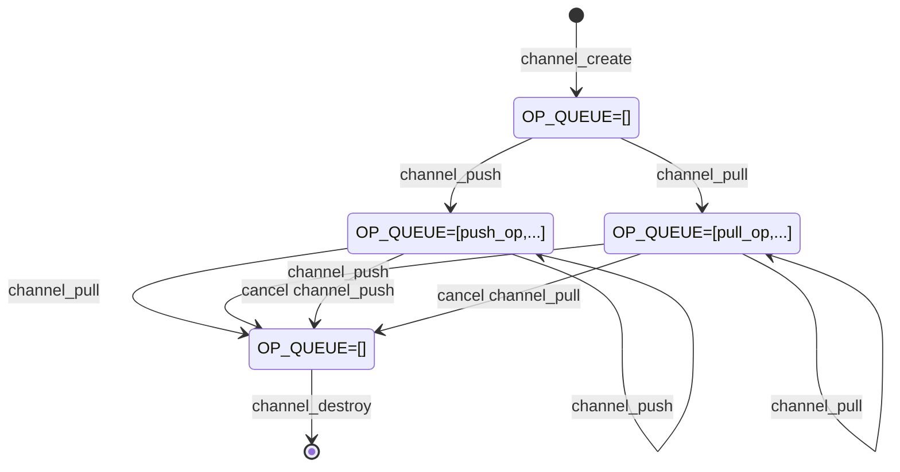
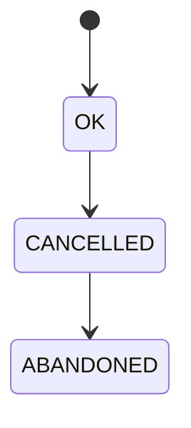

# `channel` requirements

## Overview

`channel` is a module that allows the user to move data asynchronously from producer to consumer without having to block the thread.

Consumers of data call `channel_pull` to register a `PULL_CALLBACK` function to be called when data becomes available.

Producers of data call `channel_push` to notify the channel that data is available and provide a `PUSH_CALLBACK` to be called when the data has been consumed.

`channel_pull` and `channel_push` can be called from different threads in any order. The callbacks are executed on threadpool threads.



## Operations

The first call to `channel_pull`/`channel_push` creates an `operation` and adds it to a `list of pending operations`. When `channel_push`/`channel_pull` is called subsequently, the least-recently added `operation` in the `list of pending operations` is scheduled to have its callbacks called on the threadpool. Each operation stores the `CHANNEL_CALLBACK_RESULT` that the callback should be called with.

`CHANNEL_CALLBACK_RESULT_ABANDONED`: The callbacks are called with this result when the when the module is disposing.

`CHANNEL_CALLBACK_RESULT_CANCELLED`: The callbacks are called with this result when the `operation` has been cancelled. 

`CHANNEL_CALLBACK_RESULT_OK`: The callbacks are called with this result in the success case.

`CHANNEL_CALLBACK_RESULT_ABANDONED` trumps `CHANNEL_CALLBACK_RESULT_CANCELLED` trumps `CHANNEL_CALLBACK_RESULT_OK`.



The value of the `CHANNEL_CALLBACK_RESULT` stored in the `operation` can only change in the direction shown above.  If the `operation` is abandoned, it cannot be cancelled.

## Reentrancy

`channel_pull` and `channel_push` can be called from callbacks of this module. Since the callbacks are executed on threadpool threads, there is no risk of stack overflow or deadlock.

## Need for `CHANNEL_INTERNAL`

The lifetime of the state of the `channel` module is linked to two things:
 - `THANDLE(CHANNEL)` references held by the producer and consumer.
 - `THANDLE(ASYNC_OP)` operations returned from `channel_push` and `channel_pull`. The `THANDLE(ASYNC_OP)`s need to hold references to the state of the `channel` because `async_op_cancel` needs to be able to lock the list of pending operations to remove the operation from the list.

Since the `THANDLE(ASYNC_OP)`s can outlive the `THANDLE(CHANNEL)` references and `THANDLE(ASYNC_OP)` must access the state of the `channel`, the state of the `channel` cannot be freed when the last `THANDLE(CHANNEL)` reference is released. 

To decouple the lifetime of the state from the `THANDLE(CHANNEL)` references, `THANDLE(CHANNEL_INTERNAL)` is used to store the state of the module. `THANDLE(CHANNEL)` holds a single reference to `THANDLE(CHANNEL_INTERNAL)` and each `THANDLE(ASYNC_OP)` also holds a reference to `THANDLE(CHANNEL_INTERNAL)`. When the last `THANDLE(CHANNEL)` reference is released, all pending operations are abandoned and `THANDLE(CHANNEL)` releases its reference to `THANDLE(CHANNEL_INTERNAL)`. However, `THANDLE(CHANNEL_INTERNAL)` is not freed yet because `THANDLE(ASYNC_OP)`s still hold references to it.

## Exposed API

`channel_common.h` (contains type definitions for types used in `channel.h` and `channel_internal.h`):
```c
#define CHANNEL_RESULT_VALUES \
    CHANNEL_RESULT_OK, \
    CHANNEL_RESULT_INVALID_ARGS, \
    CHANNEL_RESULT_ERROR

MU_DEFINE_ENUM(CHANNEL_RESULT, CHANNEL_RESULT_VALUES);

#define CHANNEL_CALLBACK_RESULT_VALUES \
    CHANNEL_CALLBACK_RESULT_OK, \
    CHANNEL_CALLBACK_RESULT_CANCELLED, \
    CHANNEL_CALLBACK_RESULT_ABANDONED

MU_DEFINE_ENUM(CHANNEL_CALLBACK_RESULT, CHANNEL_CALLBACK_RESULT_VALUES);

typedef void(*PULL_CALLBACK)(void* pull_context, CHANNEL_CALLBACK_RESULT result, THANDLE(RC_PTR) data);
typedef void(*PUSH_CALLBACK)(void* push_context, CHANNEL_CALLBACK_RESULT result);
```

`channel.h`:
```c

THANDLE_TYPE_DECLARE(CHANNEL);

MOCKABLE_FUNCTION(, THANDLE(CHANNEL), channel_create, THANDLE(THREADPOOL), threadpool);
MOCKABLE_FUNCTION(, CHANNEL_RESULT, channel_pull, THANDLE(CHANNEL), channel, PULL_CALLBACK, pull_callback, void*, pull_context, THANDLE(ASYNC_OP)*, out_op_pull);
MOCKABLE_FUNCTION(, CHANNEL_RESULT, channel_push, THANDLE(CHANNEL), channel, THANDLE(RC_PTR), data, PUSH_CALLBACK, push_callback, void*, push_context, THANDLE(ASYNC_OP)*, out_op_push);
MOCKABLE_FUNCTION(, void, channel_reset, THANDLE(CHANNEL), channel);

```

### channel_create
```c
    MOCKABLE_FUNCTION(, THANDLE(CHANNEL), channel_create, THANDLE(THREADPOOL), threadpool);
```

`channel_create` creates the channel and returns it.

**SRS_CHANNEL_43_077: [** If `threadpool` is `NULL`, `channel_create` shall fail and return `NULL`. **]**

**SRS_CHANNEL_43_001: [** `channel_create` shall create a `CHANNEL` object by calling `THANDLE_MALLOC` with `channel_dispose` as `dispose`. **]**

**SRS_CHANNEL_43_078: [** `channel_create` shall call create a `THANDLE(CHANNEL_INTERNAL)` by calling `channel_internal_create`.**]**

**SRS_CHANNEL_43_079: [** `channel_create` shall store the created `THANDLE(CHANNEL_INTERNAL)` in the `THANDLE(CHANNEL)`. **]**

**SRS_CHANNEL_43_086: [** `channel_create` shall succeed and return the created `THANDLE(CHANNEL)`. **]**

**SRS_CHANNEL_43_002: [** If there are any failures, `channel_create` shall fail and return `NULL`. **]**


### channel_dispose
```c
    static void channel_dispose(CHANNEL* channel);
```

`channel_dispose` disposes the given `channel` and schedules all pending operations to be abandoned.

**SRS_CHANNEL_43_094: [** `channel_dispose` shall call `channel_internal_close`. **]**

**SRS_CHANNEL_43_092: [** `channel_dispose` shall release the reference to `THANDLE(CHANNEL_INTERNAL)`. **]**


### channel_pull
```c
    MOCKABLE_FUNCTION(, CHANNEL_RESULT, channel_pull, THANDLE(CHANNEL), channel, PULL_CALLBACK, pull_callback, void*, pull_context, THANDLE(ASYNC_OP)*, out_op_pull);
```

`channel_pull` registers the given `pull_callback` to be called when there is data to be consumed.

**SRS_CHANNEL_43_007: [** If `channel` is `NULL`, `channel_pull` shall fail and return `CHANNEL_RESULT_INVALID_ARGS`. **]**

**SRS_CHANNEL_43_008: [** If `pull_callback` is `NULL`, `channel_pull` shall fail and return `CHANNEL_RESULT_INVALID_ARGS`. **]**

**SRS_CHANNEL_43_009: [** If `out_op_pull` is `NULL`, `channel_pull` shall fail and return `CHANNEL_RESULT_INVALID_ARGS`. **]**

**SRS_CHANNEL_43_011: [** `channel_pull` shall call `channel_internal_pull` and return as it returns. **]**

### channel_push
```c
    MOCKABLE_FUNCTION(, CHANNEL_RESULT, channel_push, THANDLE(CHANNEL), channel, THANDLE(RC_PTR), data, PUSH_CALLBACK, push_callback, void*, push_context, THANDLE(ASYNC_OP)*, out_op_push);
```

`channel_push` notifies the channel that there is data available and registers the given `push_callback` to be called when the given `data` has been consumed.

**SRS_CHANNEL_43_024: [** If `channel` is `NULL`, `channel_push` shall fail and return `CHANNEL_RESULT_INVALID_ARGS`. **]**

**SRS_CHANNEL_43_025: [** If `push_callback` is `NULL`, `channel_push` shall fail and return `CHANNEL_RESULT_INVALID_ARGS`. **]**

**SRS_CHANNEL_43_026: [** If `out_op_push` is `NULL`, `channel_push` shall fail and return `CHANNEL_RESULT_INVALID_ARGS`. **]**

**SRS_CHANNEL_43_041: [** `channel_push` shall call `channel_internal_push` and return as it returns. **]**


### channel_reset
```c
    MOCKABLE_FUNCTION(, void, channel_reset, THANDLE(CHANNEL), channel);
```
`channel_reset` closes the underlying `channel_internal` so  that all pending operations are abandoned.

**SRS_CHANNEL_43_087: [** If `channel` is `NULL`, `channel_reset` shall return. **]**

**SRS_CHANNEL_43_095: [** `channel_reset` shall call `channel_internal_close`. **]**

