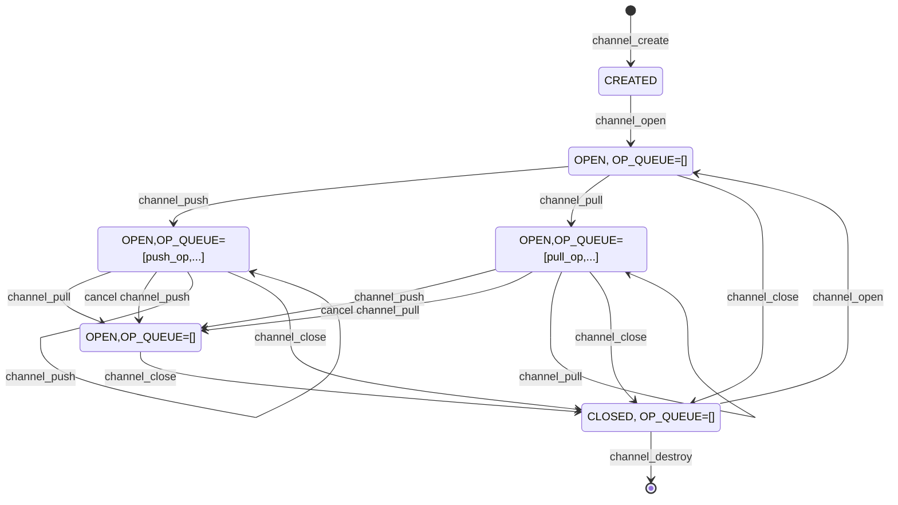

# `channel` requirements

## Overview

`channel` is a module that allows the user to move data asynchronously from producer to consumer without having to block the thread.

Consumers of data call `channel_pull` to register a `ON_DATA_AVAILABLE_CB` function to be called when data becomes available.

Producers of data call `channel_push` to notify the channel that data is available and provide a `ON_DATA_CONSUMED_CB` to be called when the data has been delivered to the consumer.

`channel_pull` and `channel_push` can be called from different threads in any order. The callbacks are executed on threadpool threads.



## Operations

The first call to `channel_pull`/`channel_push` creates an `operation` and adds it to a `list of pending operations`. When `channel_push`/`channel_pull` is called subsequently, the least-recently added `operation` in the `list of pending operations` is scheduled to have its callbacks called on the threadpool. Each operation stores the `CHANNEL_CALLBACK_RESULT` that the callback should be called with.

`CHANNEL_CALLBACK_RESULT_ABANDONED`: The callbacks are called with this result when channel is closed.

`CHANNEL_CALLBACK_RESULT_CANCELLED`: The callbacks are called with this result when the `operation` has been cancelled.

`CHANNEL_CALLBACK_RESULT_OK`: The callbacks are called with this result in the success case.

In the case when an `operation`'s callbacks are scheduled to be called with `CHANNEL_CALLBACK_RESULT_OK` but the operation is cancelled before they can execute, the callbacks are called with `CHANNEL_CALLBACK_RESULT_CANCELLED`.

Notes on operation state transitions:
- An incomplete operation (unpaired call to `channel_push`/`channel_pull`) can be cancelled.
- An `operation` that is scheduled to be called with `CHANNEL_CALLBACK_RESULT_OK` (but callbacks have not yet executed) can be cancelled.
- An `operation` that is abandoned cannot be cancelled.
- An `operation` that is cancelled cannot be complete with `CHANNEL_CALLBACK_RESULT_OK`.

## Reentrancy

`channel_pull` and `channel_push` can be called from callbacks of this module. Since the callbacks are executed on threadpool threads, there is no risk of stack overflow or deadlock.

## Exposed API

```
#define CHANNEL_RESULT_VALUES \
    CHANNEL_RESULT_OK, \
    CHANNEL_RESULT_INVALID_ARGS, \
    CHANNEL_RESULT_ERROR

MU_DEFINE_ENUM(CHANNEL_RESULT, CHANNEL_RESULT_VALUES);

#define CHANNEL_CALLBACK_RESULT_VALUES \
    CHANNEL_CALLBACK_RESULT_OK, \
    CHANNEL_CALLBACK_RESULT_CANCELLED, \
    CHANNEL_CALLBACK_RESULT_ABANDONED

MU_DEFINE_ENUM(CHANNEL_CALLBACK_RESULT, CHANNEL_CALLBACK_RESULT_VALUES);

typedef void(*ON_DATA_AVAILABLE_CB)(void* pull_context, CHANNEL_CALLBACK_RESULT result, THANDLE(RC_PTR) data);
typedef void(*ON_DATA_CONSUMED_CB)(void* push_context, CHANNEL_CALLBACK_RESULT result);

THANDLE_TYPE_DECLARE(CHANNEL);

MOCKABLE_FUNCTION(, THANDLE(CHANNEL), channel_create, THANDLE(PTR(LOG_CONTEXT_HANDLE)), log_context, THANDLE(THREADPOOL), threadpool);
MOCKABLE_FUNCTION(, int, channel_open, THANDLE(CHANNEL), channel);
MOCKABLE_FUNCTION(, void, channel_close, THANDLE(CHANNEL), channel);
MOCKABLE_FUNCTION(, CHANNEL_RESULT, channel_pull, THANDLE(CHANNEL), channel, THANDLE(RC_STRING), correlation_id, ON_DATA_AVAILABLE_CB, on_data_available_cb, void*, pull_context, THANDLE(ASYNC_OP)*, out_op_pull);
MOCKABLE_FUNCTION(, CHANNEL_RESULT, channel_push, THANDLE(CHANNEL), channel, THANDLE(RC_STRING), correlation_id, THANDLE(RC_PTR), data, ON_DATA_CONSUMED_CB, on_data_consumed_cb, void*, push_context, THANDLE(ASYNC_OP)*, out_op_push);
```

### channel_create
```c
    MOCKABLE_FUNCTION(, THANDLE(CHANNEL), channel_create, THANDLE(PTR(LOG_CONTEXT_HANDLE)), log_context, THANDLE(THREADPOOL), threadpool);
```

`channel_create` creates the channel and returns it.

**SRS_CHANNEL_43_151: [** `channel_create` shall call `sm_create`. **]**

**SRS_CHANNEL_43_098: [** `channel_create` shall call `srw_lock_create`. **]**

**SRS_CHANNEL_43_078: [** `channel_create` shall create a `CHANNEL` object by calling `THANDLE_MALLOC` with `channel_dispose` as `dispose`.**]**

**SRS_CHANNEL_43_080: [** `channel_create` shall store given `threadpool` in the created `CHANNEL`. **]**

**SRS_CHANNEL_43_149: [** `channel_create` shall store the given `log_context` in the created `CHANNEL`. **]**

**SRS_CHANNEL_43_084: [** `channel_create` shall call `DList_InitializeListHead`. **]**

**SRS_CHANNEL_43_086: [** `channel_create` shall succeed and return the created `THANDLE(CHANNEL)`. **]**

**SRS_CHANNEL_43_002: [** If there are any failures, `channel_create` shall fail and return `NULL`. **]**


### channel_open
```c
    MOCKABLE_FUNCTION(, int, channel_open, THANDLE(CHANNEL), channel);
```

channel_open` opens the given `channel`.

**SRS_CHANNEL_43_159: [** `channel_open` shall call `sm_open_begin`. **]**

**SRS_CHANNEL_43_172: [** `channel_open` shall call `srw_lock_acquire_exclusive`. **]**

**SRS_CHANNEL_43_166: [** `channel_open` shall set `is_open` to `true`. **]**

**SRS_CHANNEL_43_173: [** `channel_open` shall call `srw_lock_release_exclusive`. **]**

**SRS_CHANNEL_43_160: [** `channel_open` shall call `sm_open_end`. **]**

**SRS_CHANNEL_43_161: [** If there are any failures, `channel_open` shall fail and return a non-zero value. **]**

**SRS_CHANNEL_43_162: [** `channel_open` shall succeed and return 0. **]**


### channel_close
```c
    MOCKABLE_FUNCTION(, void, channel_close, THANDLE(CHANNEL), channel);
```

`channel_close` abandons all pending operations.

**SRS_CHANNEL_18_001: [** If `channel` is `NULL`, `channel_close` shall return immediately. **]**

**SRS_CHANNEL_43_094: [** `channel_close` shall call `sm_close_begin_with_cb` with `abandon_pending_operations` as the callback. **]**

**SRS_CHANNEL_43_167: [** `abandon_pending_operations` shall call `srw_lock_acquire_exclusive`. **]**

**SRS_CHANNEL_43_168: [** `abandon_pending_operations` shall set `is_open` to `false`. **]**

**SRS_CHANNEL_43_174: [** `abandon_pending_operations` shall make a local copy of the list of pending operations. **]**

**SRS_CHANNEL_43_175: [** `abandon_pending_operations` shall set the list of pending operations to an empty list by calling `DList_InitializeListHead`. **]**

**SRS_CHANNEL_43_169: [** `abandon_pending_operations` shall call `srw_lock_release_exclusive`. **]**

**SRS_CHANNEL_43_095: [** `abandon_pending_operations` shall iterate over the local copy and do the following: **]**

 - **SRS_CHANNEL_43_096: [** set the `result` of the `operation` to `CHANNEL_CALLBACK_RESULT_ABANDONED`. **]**

 - **SRS_CHANNEL_43_097: [** call `execute_callbacks` with the `operation` as `context`.**]**

**SRS_CHANNEL_43_100: [** `channel_close` shall call `sm_close_end`. **]**


### channel_dispose
```c
    static void channel_dispose(CHANNEL* channel);
```

`channel_dispose` disposes the given `channel`.


**SRS_CHANNEL_43_150: [** `channel_dispose` shall release the reference to the `log_context` **]**

**SRS_CHANNEL_43_091: [** `channel_dispose` shall release the reference to `THANDLE(THREADPOOL)`. **]**

**SRS_CHANNEL_43_099: [** `channel_dispose` shall call `srw_lock_destroy`. **]**

**SRS_CHANNEL_43_165: [** `channel_dispose` shall call `sm_destroy`. **]**

### channel_pull
```c
    MOCKABLE_FUNCTION(, CHANNEL_RESULT, channel_pull, THANDLE(CHANNEL), channel, THANDLE(RC_STRING), correlation_id, ON_DATA_AVAILABLE_CB, on_data_available_cb, void*, pull_context, THANDLE(ASYNC_OP)*, out_op_pull);
```

`channel_pull` registers the given `on_data_available_cb` to be called when there is data to be consumed.

**SRS_CHANNEL_43_152: [** `channel_pull` shall call `sm_exec_begin`. **]**

**SRS_CHANNEL_43_010: [** `channel_pull` shall call `srw_lock_acquire_exclusive`. **]**

**SRS_CHANNEL_43_170: [** `channel_pull` shall check if `is_open` is `true`. **]**

**SRS_CHANNEL_43_101: [** If the list of pending operations is empty or the first operation in the list of pending operations contains a `non-NULL` `on_data_available_cb`: **]**

 - **SRS_CHANNEL_43_103: [** `channel_pull` shall create a `THANDLE(ASYNC_OP)` by calling `async_op_create` with `cancel_op` as `cancel`. **]**

 - **SRS_CHANNEL_43_104: [** `channel_pull` shall store the `correlation_id`, `on_data_available_cb` and `pull_context` in the `THANDLE(ASYNC_OP)`. **]**

 - **SRS_CHANNEL_43_111: [** `channel_pull` shall set the `result` of the created `operation` to `CHANNEL_CALLBACK_RESULT_OK`. **]**

 - **SRS_CHANNEL_43_105: [** `channel_pull` shall insert the created `THANDLE(ASYNC_OP)` in the list of pending operations by calling `DList_InsertTailList`. **]**

 - **SRS_CHANNEL_43_107: [** `channel_pull` shall set `*out_op_pull` to the created `THANDLE(ASYNC_OP)`. **]**

**SRS_CHANNEL_43_108: [** If the first operation in the list of pending operations contains a `non-NULL` `on_data_consumed_cb`: **]**

 - **SRS_CHANNEL_43_109: [** `channel_pull` shall call `DList_RemoveHeadList` on the list of pending operations to obtain the `operation`. **]**

 - **SRS_CHANNEL_43_112: [** `channel_pull` shall store the `correlation_id`, `on_data_available_cb` and `pull_context` in the obtained `operation`. **]**

 - **SRS_CHANNEL_43_113: [** `channel_pull` shall call `threadpool_schedule_work` with `execute_callbacks` as `work_function` and the obtained `operation` as `work_function_context`. **]**

 - **SRS_CHANNEL_43_114: [** `channel_pull` shall set `*out_op_pull` to the `THANDLE(ASYNC_OP)` of the obtained `operation`. **]**

**SRS_CHANNEL_43_115: [** `channel_pull` shall call `srw_lock_release_exclusive`. **]**

**SRS_CHANNEL_43_011: [** `channel_pull` shall succeeds and return `CHANNEL_RESULT_OK`. **]**

**SRS_CHANNEL_43_023: [** If there are any failures, `channel_pull` shall fail and return `CHANNEL_RESULT_ERROR`. **]**


### channel_push
```c
    MOCKABLE_FUNCTION(, CHANNEL_RESULT, channel_push, THANDLE(CHANNEL), channel, THANDLE(RC_STRING), correlation_id, THANDLE(RC_PTR), data, ON_DATA_CONSUMED_CB, on_data_consumed_cb, void*, push_context, THANDLE(ASYNC_OP)*, out_op_push);
```

`channel_push` notifies the channel that there is data available and registers the given `on_data_consumed_cb` to be called when the given `data` has been consumed.

**SRS_CHANNEL_43_153: [** `channel_push` shall call `sm_exec_begin`. **]**

**SRS_CHANNEL_43_116: [** `channel_push` shall call `srw_lock_acquire_exclusive`. **]**

**SRS_CHANNEL_43_171: [** `channel_push` shall check if `is_open` is `true`. **]**

**SRS_CHANNEL_43_117: [** If the list of pending operations is empty or the first operation in the list of pending operations contains a `non-NULL` `on_data_consumed_cb`: **]**

 - **SRS_CHANNEL_43_119: [** `channel_push` shall create a `THANDLE(ASYNC_OP)` by calling `async_op_create` with `cancel_op` as `cancel`. **]**

 - **SRS_CHANNEL_43_120: [** `channel_push` shall store the `correlation_id`, `on_data_consumed_cb`, `push_context` and `data` in the `THANDLE(ASYNC_OP)`. **]**

 - **SRS_CHANNEL_43_127: [** `channel_push` shall set the `result` of the created `operation` to `CHANNEL_CALLBACK_RESULT_OK`. **]**

 - **SRS_CHANNEL_43_121: [** `channel_push` shall insert the created `THANDLE(ASYNC_OP)` in the list of pending operations by calling `DList_InsertTailList`. **]**

 - **SRS_CHANNEL_43_123: [** `channel_push` shall set `*out_op_push` to the created `THANDLE(ASYNC_OP)`. **]**

**SRS_CHANNEL_43_124: [** Otherwise (the first operation in the list of pending operations contains a `non-NULL` `on_data_available_cb`): **]**

 - **SRS_CHANNEL_43_125: [** `channel_push` shall call `DList_RemoveHeadList` on the list of pending operations to obtain the `operation`. **]**

 - **SRS_CHANNEL_43_128: [** `channel_push` shall store the `correlation_id`, `on_data_consumed_cb`, `push_context` and `data` in the obtained `operation`. **]**

 - **SRS_CHANNEL_43_129: [** `channel_push` shall call `threadpool_schedule_work` with `execute_callbacks` as `work_function` and the obtained `operation` as `work_function_context`. **]**

 - **SRS_CHANNEL_43_130: [** `channel_push` shall set `*out_op_push` to the `THANDLE(ASYNC_OP)` of the obtained `operation`. **]**

**SRS_CHANNEL_43_131: [** `channel_push` shall call `srw_lock_release_exclusive`. **]**

**SRS_CHANNEL_43_132: [** `channel_push` shall succeed and return `CHANNEL_RESULT_OK`. **]**

**SRS_CHANNEL_43_041: [** If there are any failures, `channel_push` shall fail and return `CHANNEL_RESULT_ERROR`. **]**


### cancel_op
```c
    static void cancel_op(void* channel_op_context);
```

`cancel_op` is the cancel callback that is passed to `async_op_create` when creating a `THANDLE(ASYNC_OP)` for a `channel_push` or `channel_pull` operation.

**SRS_CHANNEL_43_154: [** `cancel_op` shall call `sm_exec_begin`. **]**

**SRS_CHANNEL_43_134: [** `cancel_op` shall call `srw_lock_acquire_exclusive`. **]**

**SRS_CHANNEL_43_135: [** If the `operation` is in the list of pending `operations`, `cancel_op` shall call `DList_RemoveEntryList` to remove it. **]**

**SRS_CHANNEL_43_139: [** `cancel_op` shall call `srw_lock_release_exclusive`. **]**

**SRS_CHANNEL_43_136: [** If the `result` of the `operation` is `CHANNEL_CALLBACK_RESULT_OK`, `cancel_op` shall set it to `CHANNEL_CALLBACK_RESULT_CANCELLED`. **]**

**SRS_CHANNEL_43_138: [** If the `operation` had been found in the list of pending `operations`, `cancel_op` shall call `threadpool_schedule_work` with `execute_callbacks` as `work_function` and the `operation` as `work_function_context`. **]**

**SRS_CHANNEL_43_156: [** `cancel_op` shall call `sm_exec_end`. **]**

**SRS_CHANNEL_43_155: [** If there are any failures, `cancel_op` shall fail. **]**


### execute_callbacks
```c
    static void execute_callbacks(void* channel_op_context);
```

`execute_callbacks` is the work function that is passed to `threadpool_schedule_work` when scheduling the execution of the callbacks for an operation.

**SRS_CHANNEL_43_148: [** If `channel_op_context` is `NULL`, `execute_callbacks` shall terminate the process. **]**

**SRS_CHANNEL_43_157: [** `execute_callbacks` shall call `sm_exec_end` for each callback that is called. **]**

**SRS_CHANNEL_43_145: [** `execute_callbacks` shall call the stored callback(s) with the `result` of the `operation`.  **]**

**SRS_CHANNEL_43_147: [** `execute_callbacks` shall perform cleanup of the `operation`. **]**
