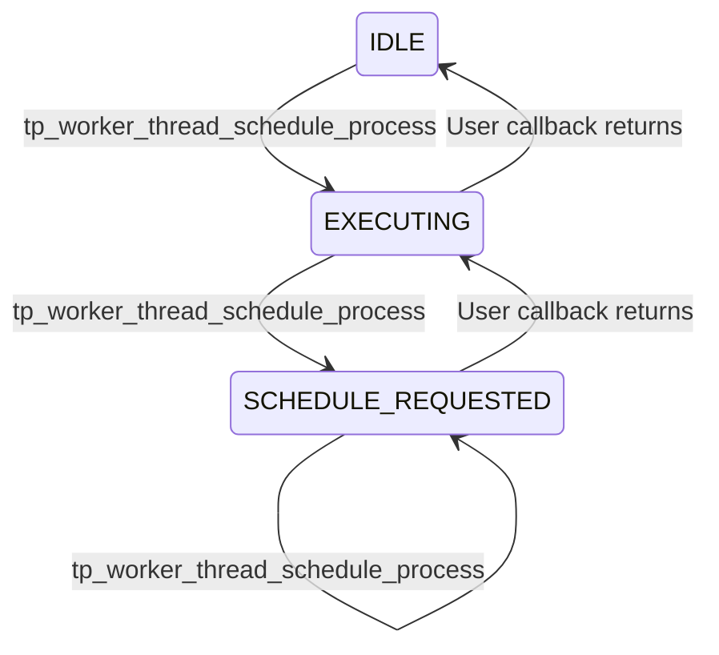

# `tp_worker_thread` Requirements

## Overview

`tp_worker_thread` is a module to run a single worker thread process on a thread pool.

Design:
- A given callback is executed on a worker thread from a thread pool.
- The callback will only ever be executed by a single thread at a time.

## History

Historically, there has been a [`worker_thread`](../../deps/c-util/devdoc/worker_thread_requirements.md) module which starts exactly one thread to run a user callback and provides a function to resume that thread when it is idle. This gives the ability to run some work on a single thread but it ties up a thread for the lifetime of the worker thread module.

There is also a [`queue_processor`](../../deps/zrpc/devdoc/queue_processor.md) module which provides a way to push arbitrary data on a queue and call a callback on a single threadpool thread to process that data. The threading logic of `queue_processor` is based on `worker_thread` but it uses threadpools so that the thread does not need to be always running when there is no work. However, `queue_processor` is not as generic and only handles work based on a queue.

This module aims to take the threadpool logic from `queue_processor` and provide the same interface as `worker_thread` so that it can be a drop-in replacement.

Note that unlike `queue_processor`, this module creates a `threadpool` from an `execution_engine` instead of having a parameter. That means that the cleanup group (in win32 threadpool terms) is owned by this module and closing the worker thread will wait for pending work items to complete. If instead we take it as a parameter, it is possible for the worker thread to continue to execute after this module is destroyed.

## States

In order to make sure that only one threadpool work item thread processes work at a given moment, a 3 states state machine is used.
The states represent a poor man's lock + a flag indicating new data:

- `IDLE`
- `EXECUTING`
- `SCHEDULE_REQUESTED`

Transitions done in `tp_worker_thread_schedule_process`:

- If state is `IDLE` then it is set to `EXECUTING` and a new threadpool work item is started.
- If state is `EXECUTING` then it is set to `SCHEDULE_REQUESTED` in order to signal the threadpool work item that it must call the user callback again.
- If state is already `SCHEDULE_REQUESTED` then no change is made.

Transitions done in the threadpool work item after the user callback returns:

- If state is `EXECUTING` then it is set to `IDLE` and the work item exits.
- If state is `SCHEDULE_REQUESTED` then it is set to `EXECUTING` and the work item calls the user callback again.
- The state will never be `IDLE` unless the thread is exiting.



## Exposed API

```c
typedef void(*TP_WORKER_THREAD_FUNC)(void* worker_func_context);

typedef struct TP_WORKER_THREAD_TAG* TP_WORKER_THREAD_HANDLE;

#define TP_WORKER_THREAD_SCHEDULE_PROCESS_RESULT_VALUES \
    TP_WORKER_THREAD_SCHEDULE_PROCESS_OK, \
    TP_WORKER_THREAD_SCHEDULE_PROCESS_INVALID_ARGS, \
    TP_WORKER_THREAD_SCHEDULE_PROCESS_INVALID_STATE \

MU_DEFINE_ENUM(TP_WORKER_THREAD_SCHEDULE_PROCESS_RESULT, TP_WORKER_THREAD_SCHEDULE_PROCESS_RESULT_VALUES)

MOCKABLE_FUNCTION(, TP_WORKER_THREAD_HANDLE, tp_worker_thread_create, EXECUTION_ENGINE_HANDLE, execution_engine, TP_WORKER_THREAD_FUNC, worker_func, void*, worker_func_context);
MOCKABLE_FUNCTION(, void, tp_worker_thread_destroy, TP_WORKER_THREAD_HANDLE, worker_thread);

MOCKABLE_FUNCTION(, int, tp_worker_thread_open, TP_WORKER_THREAD_HANDLE, worker_thread);
MOCKABLE_FUNCTION(, void, tp_worker_thread_close, TP_WORKER_THREAD_HANDLE, worker_thread);

MOCKABLE_FUNCTION(, TP_WORKER_THREAD_SCHEDULE_PROCESS_RESULT, tp_worker_thread_schedule_process, TP_WORKER_THREAD_HANDLE, worker_thread);
```

### Static Functions

```c
static void tp_worker_on_threadpool_work(void* context);
```

### tp_worker_thread_create

```c
MOCKABLE_FUNCTION(, TP_WORKER_THREAD_HANDLE, tp_worker_thread_create, EXECUTION_ENGINE_HANDLE, execution_engine, TP_WORKER_THREAD_FUNC, worker_func, void*, worker_func_context);
```

`tp_worker_thread_create` creates the threadpool worker thread.

**SRS_TP_WORKER_THREAD_42_001: [** If `execution_engine` is `NULL` then `tp_worker_thread_create` shall fail and return `NULL`. **]**

**SRS_TP_WORKER_THREAD_42_002: [** If `worker_func` is `NULL` then `tp_worker_thread_create` shall fail and return `NULL`. **]**

**SRS_TP_WORKER_THREAD_42_003: [** `tp_worker_thread_create` shall allocate memory for the worker thread. **]**

**SRS_TP_WORKER_THREAD_42_004: [** `tp_worker_thread_create` shall call `sm_create`. **]**

**SRS_TP_WORKER_THREAD_45_001: [** `tp_worker_thread_create` shall save the `execution_engine` and call `execution_engine_inc_ref`. **]**

**SRS_TP_WORKER_THREAD_42_006: [** `tp_worker_thread_create` shall return the worker thread handle. **]**

**SRS_TP_WORKER_THREAD_42_007: [** If there are any other errors then `tp_worker_thread_create` shall fail and return `NULL`. **]**

### tp_worker_thread_destroy

```c
MOCKABLE_FUNCTION(, void, tp_worker_thread_destroy, TP_WORKER_THREAD_HANDLE, worker_thread);
```

`tp_worker_thread_destroy` destroys the resources from create, implicitly closing the worker thread if it is open.

**SRS_TP_WORKER_THREAD_42_008: [** If `worker_thread` is `NULL` then `tp_worker_thread_destroy` shall return. **]**

**SRS_TP_WORKER_THREAD_42_009: [** `tp_worker_thread_destroy` shall behave as if `tp_worker_thread_close` was called. **]**

**SRS_TP_WORKER_THREAD_45_002: [** `tp_worker_thread_destroy` shall call `execution_engine_dec_ref`. **]**

**SRS_TP_WORKER_THREAD_42_011: [** `tp_worker_thread_destroy` shall call `sm_destroy`. **]**

**SRS_TP_WORKER_THREAD_42_012: [** `tp_worker_thread_destroy` shall free the memory allocated for the worker thread. **]**

### tp_worker_thread_open

```c
MOCKABLE_FUNCTION(, int, tp_worker_thread_open, TP_WORKER_THREAD_HANDLE, worker_thread);
```

`tp_worker_thread_open` opens the worker thread so it is ready to accept work.

**SRS_TP_WORKER_THREAD_42_013: [** If `worker_thread` is `NULL` then `tp_worker_thread_open` shall fail and return a non-zero value. **]**

**SRS_TP_WORKER_THREAD_42_014: [** `tp_worker_thread_open` shall call `sm_open_begin`. **]**

**SRS_TP_WORKER_THREAD_42_015: [** `tp_worker_thread_open` shall initialize the state to `IDLE`. **]**

**SRS_TP_WORKER_THREAD_45_003: [** `tp_worker_thread_open` shall call `threadpool_create` with the saved `execution_engine`. **]**

**SRS_TP_WORKER_THREAD_45_004: [** If `threadpool_create` fails then `tp_worker_thread_open` shall call `sm_open_end` with `false`. **]**

**SRS_TP_WORKER_THREAD_42_041: [** `tp_worker_thread_open` shall call `threadpool_create_work_item` with the threadpool, `tp_worker_on_threadpool_work` and `worker_thread`. **]**

**SRS_TP_WORKER_THREAD_01_001: [** `tp_worker_thread_open` shall save the `THANDLE(THREADPOOL_WORK_ITEM)` for later use by using `THANDLE_INITIALIZE_MOVE(THREADPOOL_WORK_ITEM)`. **]**

**SRS_TP_WORKER_THREAD_42_043: [** If `threadpool_create_work_item` fails then `tp_worker_thread_open` shall call `sm_open_end` with `false`. **]**

**SRS_TP_WORKER_THREAD_42_018: [** `tp_worker_thread_open` shall call `sm_open_end` with `true`. **]**

**SRS_TP_WORKER_THREAD_42_019: [** `tp_worker_thread_open` shall succeed and return 0. **]**

**SRS_TP_WORKER_THREAD_42_020: [** If there are any errors then `tp_worker_thread_open` shall fail and return a non-zero value. **]**

### tp_worker_thread_close

```c
MOCKABLE_FUNCTION(, void, tp_worker_thread_close, TP_WORKER_THREAD_HANDLE, worker_thread);
```

`tp_worker_thread_close` closes the worker thread so it will not accept any more work, waiting for the current work to finish.

**SRS_TP_WORKER_THREAD_42_021: [** If `worker_thread` is `NULL` then `tp_worker_thread_close` shall return. **]**

**SRS_TP_WORKER_THREAD_42_022: [** `tp_worker_thread_close` shall call `sm_close_begin`. **]**

**SRS_TP_WORKER_THREAD_01_002: [** `tp_worker_thread_close` shall call `THANDLE_ASSIGN(THREADPOOL_WORK_ITEM)` with `NULL`. **]**

**SRS_TP_WORKER_THREAD_45_005: [** `tp_worker_thread_close` shall call `THANDLE_ASSIGN(THREADPOOL)` with `NULL`. **]**

**SRS_TP_WORKER_THREAD_42_024: [** `tp_worker_thread_close` shall call `sm_close_end`. **]**

### tp_worker_thread_schedule_process

```c
MOCKABLE_FUNCTION(, TP_WORKER_THREAD_SCHEDULE_PROCESS_RESULT, tp_worker_thread_schedule_process, TP_WORKER_THREAD_HANDLE, worker_thread);
```

`tp_worker_thread_schedule_process` starts the worker thread if it is not already running. This function is idempotent and will return `TP_WORKER_THREAD_SCHEDULE_PROCESS_OK` if the worker thread is already running.

**SRS_TP_WORKER_THREAD_42_025: [** If `worker_thread` is `NULL` then `tp_worker_thread_schedule_process` shall fail and return `TP_WORKER_THREAD_SCHEDULE_PROCESS_INVALID_ARGS`. **]**

**SRS_TP_WORKER_THREAD_42_026: [** `tp_worker_thread_schedule_process` shall call `sm_exec_begin`. **]**

**SRS_TP_WORKER_THREAD_42_027: [** If `sm_exec_begin` fails then `tp_worker_thread_schedule_process` shall return `TP_WORKER_THREAD_SCHEDULE_PROCESS_INVALID_STATE`. **]**

**SRS_TP_WORKER_THREAD_42_028: [** If the state is `EXECUTING` then `tp_worker_thread_schedule_process` shall set the state to `SCHEDULE_REQUESTED` and return `TP_WORKER_THREAD_SCHEDULE_PROCESS_OK`. **]**

**SRS_TP_WORKER_THREAD_42_029: [** If the state is `IDLE` then: **]**

 - **SRS_TP_WORKER_THREAD_42_030: [** `tp_worker_thread_schedule_process` shall set the state to `EXECUTING`. **]**

 - **SRS_TP_WORKER_THREAD_42_031: [** `tp_worker_thread_schedule_process` shall call `threadpool_schedule_work_item` on the work item created in the module open. **]**

 - **SRS_TP_WORKER_THREAD_42_035: [** `tp_worker_thread_schedule_process` shall return `TP_WORKER_THREAD_SCHEDULE_PROCESS_OK`. **]**

**SRS_TP_WORKER_THREAD_42_036: [** `tp_worker_thread_schedule_process` shall call `sm_exec_end`. **]**

### tp_worker_on_threadpool_work

```c
static void tp_worker_on_threadpool_work(void* context);
```

`tp_worker_on_threadpool_work` is the function executed on the threadpool.

**SRS_TP_WORKER_THREAD_42_037: [** If `context` is `NULL` then `tp_worker_on_threadpool_work` shall terminate the process. **]**

**SRS_TP_WORKER_THREAD_42_038: [** `tp_worker_on_threadpool_work` shall call `worker_func` with `worker_func_context`. **]**

**SRS_TP_WORKER_THREAD_42_039: [** If the state is `EXECUTING` then `tp_worker_on_threadpool_work` shall change the state to `IDLE` and return. **]**

**SRS_TP_WORKER_THREAD_42_040: [** If the state is `SCHEDULE_REQUESTED` then `tp_worker_on_threadpool_work` shall change the state to `EXECUTING` and repeat. **]**
