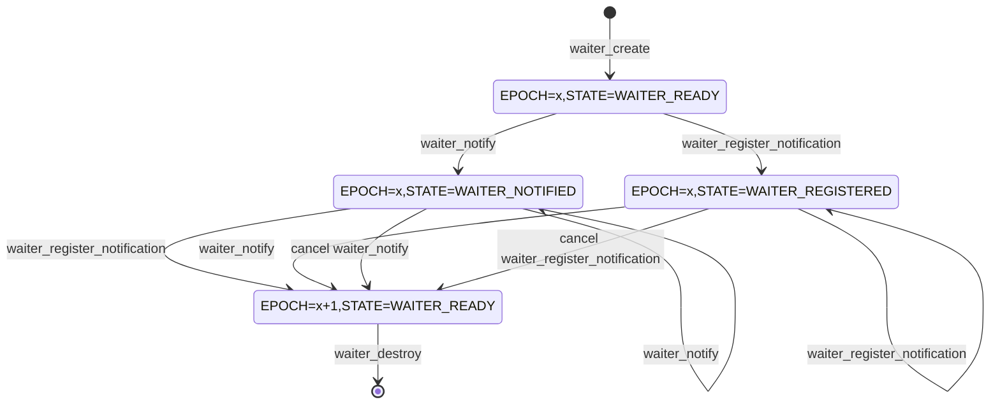

# `waiter` requirements

## Overview

`waiter` is a module that allows the user to move data asynchronously from producer to consumer without having to block the thread.

Consumers of data call `waiter_register_notification` to register a `NOTIFICATION_CALLBACK` function to be called when data becomes available.

Producers of data call `waiter_notify` to notify the waiter that data is available.

`waiter_register_notification` and `waiter_notify` can be called from different threads in any order.

## `waiter` state

The state of the `waiter` module consists of two components:
- EPOCH: This is a monotonically increasing integer that is incremented every time an operation is completed or cancelled.
- Internal state: This is an enum that can have the following values:
  - `WAITER_READY`: This is the default state. In this state, the module accepts calls to `waiter_register_notification` and `waiter_notify`
  - `WAITER_NOTIFYING`: This is a temporary state when `waiter_notify` is executing. It causes concurrent calls to `waiter_register_notification` to wait.
  - `WAITER_NOTIFIED`: This is the state when `waiter_notify` has completed execution. A subsequent call to `waiter_register_notification` will result in the callbacks being called synchronously.
  - `WAITER_REGISTERING`: This is a temporary state when `waiter_register_notification` is executing. It causes concurrent calls to `waiter_notify` to wait.
  - `WAITER_REGISTERED`: This is the state when `waiter_register_notification` has completed execution. A subsequent call to `waiter_notify` will result in the callback being called synchronously.

Both components are stored in a single `volatile_atomic` variable that is manipulated using `interlocked` APIs.



## Reentrancy

`waiter` is reentrant. This means that `waiter_register_notification` and `waiter_notify` can be called from callbacks of this module.

## Exposed API
```c
#define WAITER_RESULT_VALUES \
    WAITER_RESULT_SYNC, \
    WAITER_RESULT_ASYNC, \
    WAITER_RESULT_REFUSED, \
    WAITER_RESULT_INVALID_ARGS, \
    WAITER_RESULT_ERROR

MU_DEFINE_ENUM(WAITER_RESULT, WAITER_RESULT_VALUES);

#define WAITER_CALLBACK_RESULT_VALUES \
    WAITER_CALLBACK_RESULT_OK, \
    WAITER_CALLBACK_RESULT_CANCELLED, \
    WAITER_CALLBACK_RESULT_ABANDONED

MU_DEFINE_ENUM(WAITER_CALLBACK_RESULT, WAITER_CALLBACK_RESULT_VALUES);

#include "umock_c/umock_c_prod.h"
#ifdef __cplusplus
extern "C" {
#endif /* __cplusplus */

typedef void(*NOTIFICATION_CALLBACK)(void* context, THANDLE(RC_PTR) data, WAITER_CALLBACK_RESULT result);
typedef void(*NOTIFY_COMPLETE_CALLBACK)(void* context, WAITER_CALLBACK_RESULT result);
typedef struct WAITER_TAG WAITER;

THANDLE_TYPE_DECLARE(WAITER);

    MOCKABLE_FUNCTION(, THANDLE(WAITER), waiter_create)
    MOCKABLE_FUNCTION(, WAITER_RESULT, waiter_register_notification, THANDLE(WAITER), waiter, NOTIFICATION_CALLBACK, notification_callback, void*, context, THANDLE(ASYNC_OP)*, out_op);
    MOCKABLE_FUNCTION(, WAITER_RESULT, waiter_notify, THANDLE(WAITER), waiter, THANDLE(RC_PTR), data, NOTIFY_COMPLETE_CALLBACK, notify_complete_callback, void*, context, THANDLE(ASYNC_OP)*, out_op);

#ifdef __cplusplus
}
#endif /* __cplusplus */

```

### waiter_create
```c
    MOCKABLE_FUNCTION(, WAITER_HANDLE, waiter_create)
```

`waiter_create` creates the waiter and returns it.

**SRS_WAITER_43_001: [** `waiter_create` shall call `THANDLE_MALLOC` with `dispose` as `waiter_dispose`. **]**

**SRS_WAITER_43_056: [** `waiter_create` shall set the `state` to `WAITER_READY` and `EPOCH` to `0` by calling `interlocked_exchange`. **]**

**SRS_WAITER_43_002: [** If there are any failures, `waiter_create` shall fail and return `NULL`. **]**

### waiter_dispose
```c
    void waiter_dispose(WAITER* waiter)
```

`waiter_dispose` disposes the given `waiter`.

**SRS_WAITER_43_004: [** `waiter_dispose` shall obtain the current state of the waiter by calling `interlocked_add`. **]**

**SRS_WAITER_43_057: [** If the current `state` is `WAITER_REGISTERING` or `WAITER_NOTIFYING`, `waiter_dispose` shall wait for the state to change by calling `wait_on_address`. **]**

**SRS_WAITER_43_058: [** If the current `state` is `WAITER_REGISTERED`, `waiter_dispose` shall call the `notification_callback` given to `waiter_register_notification` with `context` as the `context` given to `waiter_register_notification`, and `result` as `WAITER_CALLBACK_RESULT_ABANDONED`. **]**

**SRS_WAITER_43_006: [** If the current `state` is `WAITER_NOTIFIED`, `waiter_dispose` shall: **]**

- **SRS_WAITER_43_044: [** call the `notify_complete_callback` given to `waiter_notify` with `context` as the `context` given to `waiter_notify`, and `result` as `WAITER_RESULT_ABANDONED`. **]**

- **SRS_WAITER_43_045: [** release the reference to `data` stored in `waiter` by calling `THANDLE_ASSIGN`. **]**

### waiter_register_notification
```c
    MOCKABLE_FUNCTION(, WAITER_RESULT, waiter_register_notification, THANDLE(WAITER), waiter, NOTIFICATION_CALLBACK, notification_callback, void*, context, THANDLE(ASYNC_OP)*, out_op);
```

`waiter_register_notification` registers the given `notification_callback` to be called when there is data to be consumed.

**SRS_WAITER_43_007: [** If `waiter` is `NULL`, `waiter_register_notification` shall fail and return `WAITER_RESULT_INVALID_ARGS`. **]**

**SRS_WAITER_43_008: [** If `notification_callback` is `NULL`, `waiter_register_notification` shall fail and return `WAITER_RESULT_INVALID_ARGS`. **]**

**SRS_WAITER_43_009: [** If `out_op` is `NULL`, `waiter_register_notification` shall fail and return `WAITER_RESULT_INVALID_ARGS`. **]**

**SRS_WAITER_43_010: [** `waiter_register_notification` shall call `interlocked_add` to obtain the current `state` of the `waiter`. **]**

**SRS_WAITER_43_011: [** If the current `state` is `WAITER_REGISTERING` or `WAITER_REGISTERED`, `waiter_register_notification` shall fail and return `WAITER_RESULT_REFUSED`. **]**

**SRS_WAITER_43_059: [** If the current `state` is `WAITER_NOTIFYING`, `waiter_register_notification` shall wait for the `state` to change by calling `wait_on_address`. **]**

**SRS_WAITER_43_012: [** If the current `state` is `WAITER_NOTIFIED`, `waiter_register_notification` shall : **]**

- **SRS_WAITER_43_060: [** store `notify_complete_callback`, `context` and `data` given to `waiter_notify`. **]**

- **SRS_WAITER_43_042: [** call `interlocked_compare_exchange` to increment the `EPOCH` and change the state to `WAITER_READY`. **]**

- **SRS_WAITER_43_013: [** call the given `notification_callback` with `context` as the given `context`, `data` as the stored `data` and `result` as `WAITER_RESULT_OK`. **]**

- **SRS_WAITER_43_053: [** release the reference to the stored `data` by calling `THANDLE_ASSIGN`. **]**

- **SRS_WAITER_43_014: [** call the `notify_complete_callback` given to `waiter_notify` with the `context` given to `waiter_notify` and `result` as `WAITER_RESULT_OK`. **]**

- **SRS_WAITER_43_054: [** set `out_op` to `NULL` by calling `THANDLE_ASSIGN`. **]**

- **SRS_WAITER_43_015: [** return `WAITER_RESULT_SYNC`. **]**

**SRS_WAITER_43_016: [** If the current state is `WAITER_READY`, `waiter_register_notification` shall: **]**

**SRS_WAITER_43_061: [** set the state to `WAITER_REGISTERING` by calling `interlocked_compare_exchange`. **]**

- **SRS_WAITER_43_017: [** call `async_op_create` with `cancel_register_notification` as the cancel function. **]**

- **SRS_WAITER_43_018: [** store the given `notification_callback` and the given `context` in the `waiter`. **]**

- **SRS_WAITER_43_019: [** store `state` in the created `THANDLE(ASYNC_OP)`. **]**

- **SRS_WAITER_43_020: [** store the given `waiter` in the created `THANDLE(ASYNC_OP)` by calling `THANDLE_INITIALIZE`. **]**

- **SRS_WAITER_43_021: [** store the created `THANDLE(ASYNC_OP)` in `out_op` by calling `THANDLE_INITIALIZE_MOVE`. **]**

- **SRS_WAITER_43_062: [** set the `state` of the given `waiter` to `WAITER_REGISTERED` by calling `interlocked_exchange`. **]**

- **SRS_WAITER_43_063: [** signal waiting threads by calling `wake_by_address_all`. **]**

- **SRS_WAITER_43_022: [** return `WAITER_RESULT_ASYNC`. **]**

**SRS_WAITER_43_023: [** If there are any failures, `waiter_register_notification` shall fail and return `WAITER_RESULT_ERROR`. **]**

### cancel_register_notification
```
static void cancel_register_notification(void* context)
```

`cancel_register_notification` is the cancel function given to `async_op_create` when `waiter_register_notification` is called.

**SRS_WAITER_43_046: [** If the current `EPOCH` and `state` of the `waiter` is the same as the initial `EPOCH` and `state` of the `waiter` when `waiter_register_notification` was called, `cancel_register_notification` shall: **]**

 **SRS_WAITER_43_047: [** increment the `EPOCH` and set the `state` of the `waiter` stored in the given `context` to `WAITER_READY` by calling `interlocked_compare_exchange`. **]**

 **SRS_WAITER_43_048: [** call the `notification_callback` given to `waiter_register_notification` with `context` as the `context` given to `waiter_register_notification`, `data` as `NULL` and `result` as `WAITER_RESULT_CANCELLED`. **]**


### waiter_notify
```c
    MOCKABLE_FUNCTION(, WAITER_RESULT, waiter_notify, THANDLE(WAITER), waiter, THANDLE(RC_PTR), data, NOTIFY_COMPLETE_CALLBACK, notify_complete_callback, void*, context, THANDLE(ASYNC_OP)*, out_op);
```

`waiter_notify` notifies the waiter that there is data available and registers the given `notify_complete_callback` to be called when the given `data` has been consumed.

**SRS_WAITER_43_024: [** If `waiter` is `NULL`, `waiter_notify` shall fail and return `WAITER_RESULT_INVALID_ARGS`. **]**

**SRS_WAITER_43_025: [** If `notify_complete_callback` is `NULL`, `waiter_notify` shall fail and return `WAITER_RESULT_INVALID_ARGS`. **]**

**SRS_WAITER_43_026: [** If `out_op` is `NULL`, `waiter_notify` shall fail and return `WAITER_RESULT_INVALID_ARGS`. **]**

**SRS_WAITER_43_027: [** `waiter_notify` shall call `interlocked_add` to obtain the current `state` of the `waiter`. **]**

**SRS_WAITER_43_028: [** If the current `state` is `WAITER_NOTIFYING` or `WAITER_NOTIFIED`, `waiter_notify` shall fail and return `WAITER_RESULT_REFUSED`. **]**

**SRS_WAITER_43_064: [** If the current `state` is `WAITER_REGISTERING`, `waiter_notify` shall wait for the `state` to change by calling `wait_on_address`. **]**

**SRS_WAITER_43_029: [** If the current `state` is `WAITER_REGISTERED`, `waiter_notify` shall: **]**

- **SRS_WAITER_43_043: [** call `interlocked_compare_exchange` to increment the `EPOCH` and change the state to `WAITER_READY`. **]**

- **SRS_WAITER_43_030: [** call the `notification_callback` given to `waiter_register_notification` with `context` as the `context` given to `waiter_register_notification`, `data` as the given `data` and `result` as `WAITER_RESULT_OK`. **]**

- **SRS_WAITER_43_031: [** call the given `notify_complete_callback` with `context` as the given `context` and `result` as `WAITER_RESULT_OK`. **]**

- **SRS_WAITER_43_055: [** set `out_op` to `NULL` by calling `THANDLE_ASSIGN`. **]**

- **SRS_WAITER_43_032: [** return `WAITER_RESULT_SYNC`. **]**

**SRS_WAITER_43_033: [** If the current state is `WAITER_READY`, `waiter_notify` shall: **]**

- **SRS_WAITER_43_065: [** set the state to `WAITER_NOTIFYING` by calling `interlocked_compare_exchange`. **]**

- **SRS_WAITER_43_034: [** call `async_op_create` with `cancel_notify` as the cancel function. **]**

- **SRS_WAITER_43_035: [** store the given `notify_complete_callback` and the given `context` in the `waiter`. **]**

- **SRS_WAITER_43_036: [** store the given `data` in the `waiter` by calling `THANDLE_INITIALIZE`. **]**

- **SRS_WAITER_43_037: [** store `state` in the created `THANDLE(ASYNC_OP)`. **]**

- **SRS_WAITER_43_038: [** store the given `waiter` in the created `THANDLE(ASYNC_OP)` by calling `THANDLE_INITIALIZE`. **]**

- **SRS_WAITER_43_039: [** store the created `THANDLE(ASYNC_OP)` in `out_op`by calling `THANDLE_INITIALIZE_MOVE`. **]**

set the `state` of the given `waiter` to `WAITER_NOTIFIED` by calling `interlocked_exchange`.

signal waiting threads by calling `wake_by_address_all`.

- **SRS_WAITER_43_040: [** return `WAITER_RESULT_ASYNC`. **]**

**SRS_WAITER_43_041: [** If there are any failures, `waiter_notify` shall fail and return `WAITER_RESULT_ERROR`. **]**


### cancel_notify
```c
static void cancel_notify(void* context)
```

`cancel_notify` is the cancel function given to `async_op_create` when `waiter_notify` is called.

**SRS_WAITER_43_049: [** If the current `EPOCH` and `state` of the `waiter` is the same as the initial `EPOCH` and `state` of the `waiter` when `waiter_notify` was called, `cancel_notify` shall: **]**

- **SRS_WAITER_43_050: [** increment the `EPOCH` and unset the `NOTIFIED` bit by calling `interlocked_compare_exchange`. **]**

- **SRS_WAITER_43_051: [** call the `notify_complete_callback` given to `waiter_notify` with `context` as the `context` given to `waiter_notify` and `result` as `WAITER_RESULT_CANCELLED`. **]**

- **SRS_WAITER_43_052: [** release the reference to `data` stored in `waiter` by calling `THANDLE_ASSIGN`. **]**
